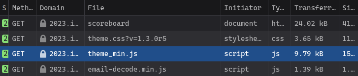
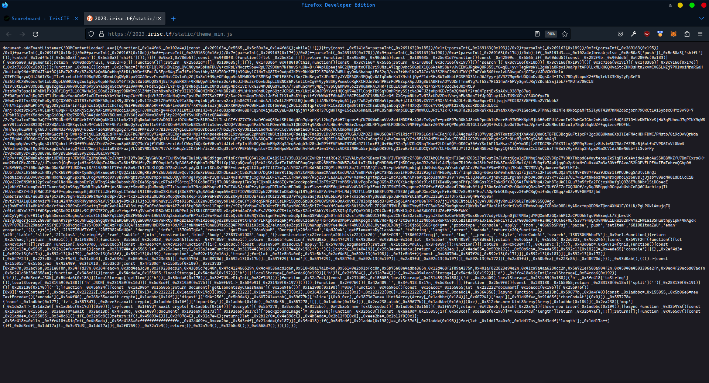
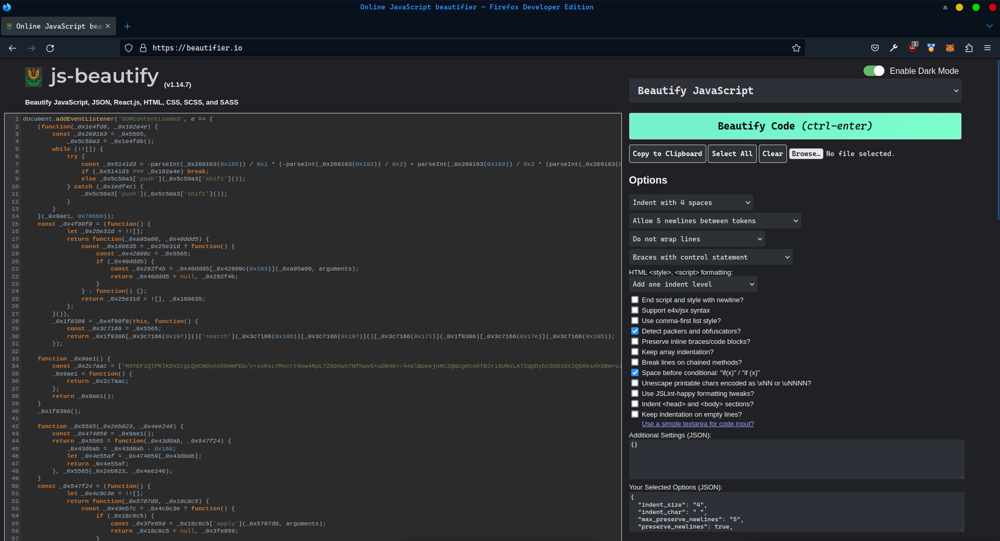
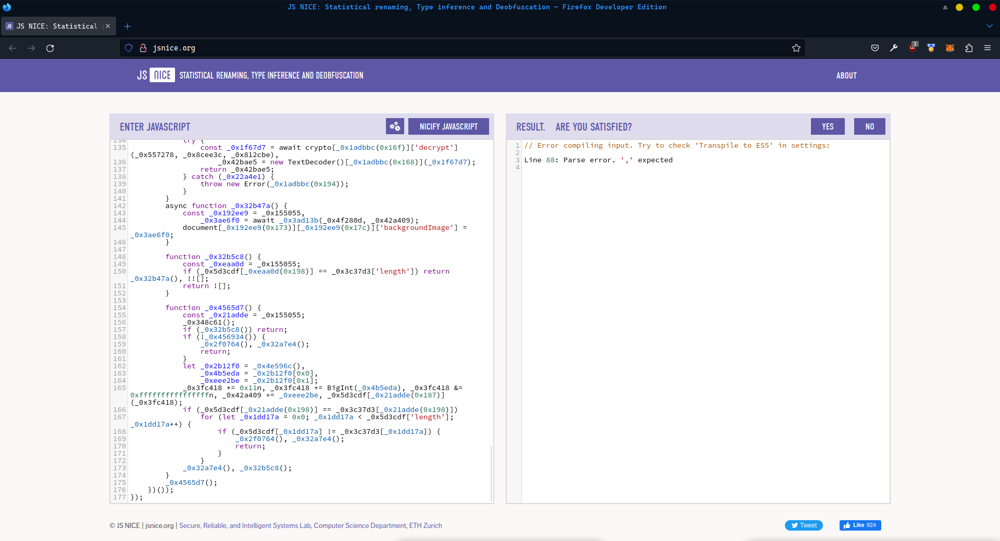
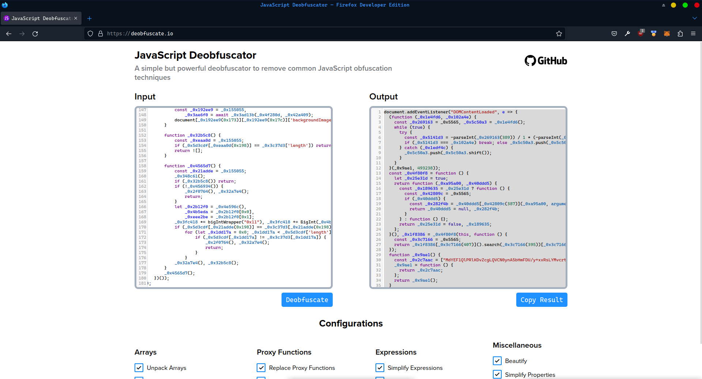
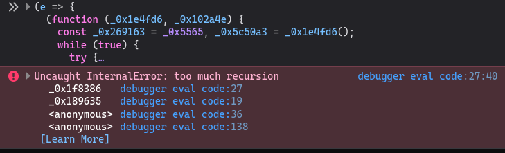
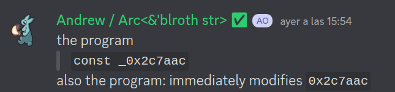
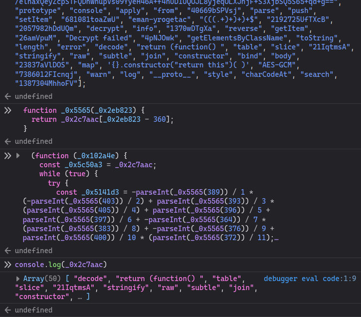

#### irisctf2023/rev
# Scoreboard Website Easter Egg
by Arc'blroth

This was a pretty interesting challenge overall, especially with some of the tricks the source code pulls. Get ready to roll your own scripts, because this code won't be rev'd without a fight!

## The Unformattable Script

> "there's a script in my scoreboard" - woody

True to the flavortext, a quick inspect element on the Scoreboard page reveals that there is an impostor among us:





`theme-min.js` doesn't look anything like a typical minified script - that usage of hexadecimal identifiers is a dead giveaway that someone has obfuscated this code!

Luckily, there's deobfuscators for these types of scripts. Let's run `theme-min` through a beautifier so I can actually read it, then throw it into the first page of Google and see what we get:



<p align="center">
	<br>
	<i>hits No button</i>
</p>
<br>

...welp. This script is getting more cursed by the second. Line 88 seems to declare an array of numbers that all end in `n`:

```js
_0x3c37d3 = [0x2b47n, 0x2ec76n, ...
```

which according to [MDN](https://developer.mozilla.org/en-US/docs/Web/JavaScript/Reference/Global_Objects/BigInt#description) is a shorthand for creating an `BigInt`. (Given the usage of hexadecimal constants we're probably looking at some sort of crypto impl here.)

Thus, to get the deobfuscators to run, we can do a quick find-and-replace from all of the BigInt literals to a BigInt constructor invocation `((0x)?[0-9a-f]+?)n(?=[ ,\]])` &rarr; `bigIntWrapper("$1")`. Throwing the "fixed" script into another deobfuscator gives us a script that should be a bit easier to work with:



...except there's one problem.


If we run our slightly-more-deobfuscated script back on the scoreboard page, Firefox will complain about a literal stack overflow:



This doesn't occur with the original script, meaning that somewhere along the way one of our deobfuscators made a mistake in the face of the horrors of JS. Since we have no other choice, let's try to manually figure out what's going on here:

```js
const _0x4f80f8 = function () {
  let _0x25e31d = true;
  return function (_0xa95a00, _0x40ddd5) {
    const _0x189635 = _0x25e31d ? function () {
      const _0x42809c = _0x5565;
      if (_0x40ddd5) {
        const _0x282f4b = _0x40ddd5[_0x42809c(387)](_0xa95a00, arguments);
        return _0x40ddd5 = null, _0x282f4b;
      }
    } : function () {};
    return _0x25e31d = false, _0x189635;
  };
}(), _0x1f8386 = _0x4f80f8(this, function () {
  const _0x3c7166 = _0x5565;
  return _0x1f8386[_0x3c7166(407)]().search(_0x3c7166(395))[_0x3c7166(407)]()[_0x3c7166(369)](_0x1f8386)[_0x3c7166(382)](_0x3c7166(395));
});
```

The stack trace from above points to this block of code, which
- creates a function by calling
	- a function that, on the first invocation only, returns
		- a function that does _something_ with its two arguments (`this` and the following block of code)

> We'll see later that that final something is a `Function.apply` call, making this quite possibly the most obfuscated function invocation in existence!

The liberal usage of the [comma operator](https://developer.mozilla.org/en-US/docs/Web/JavaScript/Reference/Operators/Comma_Operator) along with the once-init pattern is probably what's confusing the deobfuscators. Rather than fixing it, we'll just leave  `_0x1f8386` and `_0x43d0ab` (the two functions that are initialized in this pattern) unformatted for now and keep the rest of the codebase formatted as we continue to rev.

## Introducing the Un0x5565inator!

Looking at the now mostly beautified script, one of the things that immediately caught my attention was the giant constant array `_0x2c7aac`:
```js
function _0x9ae1() {
  const _0x2c7aac = ["MdYEF1QlPRlKDvZcg...", /* ... */];
  _0x9ae1 = function () {
    return _0x2c7aac;
  };
  return _0x9ae1();
}
```

We can simplify the `_0x9ae1` function by statically evaluating the function calls (a technique I'll use a lot here) and get

```js
function _0x9ae1() {
  const _0x2c7aac = ["MdYEF1QlPRlKDvZcg...", /* ... */];
  return _0x2c7aac;
}
```

which then lets us replace every instance of `_0x9ae1()` with just the constant `_0x2c7aac`:

```diff
-  (function (_0x1e4fd6, _0x102a4e) {
-    const _0x269163 = _0x5565, _0x5c50a3 = _0x1e4fd6();
+  (function (_0x102a4e) {
+    const _0x269163 = _0x5565, _0x5c50a3 = _0x2c7aac;
     // -- snip ---
-  }(_0x9ae1, 493238));
+  }(493238));

   // -- snip --
   
   function _0x5565(_0x2eb823, _0x4ee246) {
-    const _0x474059 = _0x9ae1();
     return _0x5565 = function (_0x43d0ab, _0x547f24) {
       _0x43d0ab = _0x43d0ab - 360;
-      let _0x4e55af = _0x474059[_0x43d0ab];
+      let _0x4e55af = _0x2c7aac[_0x43d0ab];
       return _0x4e55af;
     }, _0x5565(_0x2eb823, _0x4ee246);
   }
```

Of these two functions, `_0x5565` seems a lot more interesting because it's invoked almost everywhere else in the code, including in the first function in the code block above. Simplifying `_0x5565` (yes that second argument is entirely useless) gives us

```js
function _0x5565(_0x2eb823) {
  return _0x2c7aac[_0x2eb823 - 360];
}
```

Looking through the usages of `_0x5565` and its synonyms, we can see that it's always called with a single argument that is greater than 360, which means that this rev is probably correct (woohoo!). At this point, we can replace all of the synonyms of `_0x5565` with `_0x5565` (I did this manually), then statically evaluate all of those calls at once with a quick script:

```js
// un0x5565inator.js
(/** @param {string} code */ code => {
    const _0x2c7aac = [/* the giant constant array */]
    function _0x5565(_0x2eb823) {
        return _0x2c7aac[_0x2eb823 - 360];
    }

    navigator.clipboard.writeText(code.replace(/_0x5565\((\d*?)\)/g, (_, p1) => JSON.stringify(_0x5565(Number(p1)))))
})
```

And now we can just remove- wait a minute.

```js
const _0x5141d3 = -parseInt("slice") / 1 * (-parseInt("warn") / 2) + parseInt("subtle") / 3 * (parseInt("__proto__") / 4) /* ... */
```
```js
document["(((.+)+)+)+$"]["Decrypt failed"].backgroundImage = _0x3ae6f0;
```

Something doesn't look _quite_ right with that replacement. Did I accidentally mess up something when replacing `_0x5565`'s synonyms? Or is there something else going on here?



```js
(function (_0x102a4e) {
  const _0x5c50a3 = _0x2c7aac;
  while (true) {
    try {
      const _0x5141d3 = -parseInt(_0x5565(389)) / 1 * (-parseInt(_0x5565(403)) / 2) + parseInt(_0x5565(393)) / 3 * (parseInt(_0x5565(405)) / 4) + parseInt(_0x5565(396)) / 5 + parseInt(_0x5565(397)) / 6 + -parseInt(_0x5565(364)) / 7 * (parseInt(_0x5565(383)) / 8) + -parseInt(_0x5565(376)) / 9 + parseInt(_0x5565(400)) / 10 * (parseInt(_0x5565(372)) / 11);
      if (_0x5141d3 === _0x102a4e) break; else _0x5c50a3.push(_0x5c50a3.shift());
    } catch (_0x1edf4c) {
      _0x5c50a3.push(_0x5c50a3.shift());
    }
  }
}(493238));
```

Taking a look at the very first function declared, I noticed that it actually modifies the supposedly-constant `_0x2c7aac` array (indirectly through `_0x5c50a3`). Rust's mutability rules really blindsighted me here! Luckily, if we just run this particular function through an interpreter we can get The True Value of `_0x2c7aac`:



Plugging The True Value of `_0x2c7aac` back into our `un0x5565inator.js` script from earlier gives us much more reasonable replacements for the rest of the code:

```js
const _0x5141d3 = -parseInt("40669bSPVsj") / 1 * (-parseInt("26amVpuM") / 2) + parseInt("681081toaZwU") / 3 * (parseInt("4pNJOwk") / 4) /* ... */
```
```js
document["body"]["style"].backgroundImage = _0x3ae6f0;
```

And now, after all that work, we can safely delete `_0x2c7aac`, `_0x5565`, and the `_0x2c7aac` decoder function from the code. We're getting close, I can feel it!

## Dead Code Everywhere

Now that all of the `_0x2c7aac` constants are back where they should be, we can also go ahead and fixup all of the bracket notation to make the code a bit easier to read:

```js
(/** @param {string} code */ code => {
    navigator.clipboard.writeText(code.replace(/\["([a-zA-Z]*?)"\]/g, (_, p1) => `.${p1}`))
})
```

Starting from the top of what we have left, we have the first un-beautifiable function

```js
const _0x4f80f8 = function () {
  let _0x25e31d = true;
  return function (_0xa95a00, _0x40ddd5) {
    const _0x189635 = _0x25e31d ? function () {
      if (_0x40ddd5) {
        const _0x282f4b = _0x40ddd5.apply(_0xa95a00, arguments);
        return _0x40ddd5 = null, _0x282f4b;
      }
    } : function () {};
    return _0x25e31d = false, _0x189635;
  };
}(), _0x1f8386 = _0x4f80f8(this, function () {
  return _0x1f8386.toString().search("(((.+)+)+)+$").toString().constructor(_0x1f8386).search("(((.+)+)+)+$");
});
_0x1f8386();
```

Now that the `_0x2c7aac` constants have been removed, it's a lot more obvious that `_0x4f80f8` is _really_ just a glorified `Function.apply` call. Since the result of `_0x1f8386.toString()...` isn't used for anything and none of the other variables here are ever used again, this entire block of code simplifies down to

```js
;
```

absolutely nothing! Similar logic applies to the next block of code / the second un-beautifiable function - all it appears to do is set the prototypes of the various functions on `window.console` to themselves, which again does absolutely nothing but prevent our team from getting third blood.

So what we have left? Judging by the usage of `crypto.subtle` and the words `AES-GCM`, the final chunk of code should be the flag decoder. Let's analyze this!

## Un Tour de Catégories

```js
var _0x42a409, _0x3fc418, _0x5d3cdf;

function _0x348c61() {
  !localStorage.getItem("b") || !localStorage.getItem("h") ? (_0x2f0764(), _0x32a7e4()) : (_0x42a409 = localStorage.getItem("d"), _0x3fc418 = BigInt(localStorage.getItem("b")), _0x5d3cdf = JSON.parse(localStorage.getItem("h")).map(_0x82f749 => BigInt(_0x82f749)));
}
function _0x32a7e4() {
  localStorage.setItem("d", _0x42a409), localStorage.setItem("b", _0x3fc418.toString()), localStorage.setItem("h", JSON.stringify(_0x5d3cdf.map(_0x50fb91 => _0x50fb91.toString())));
}
function _0x2f0764() {
  _0x42a409 = "", _0x3fc418 = BigInt("0x17"), _0x5d3cdf = [];
}

// -- snip --

function _0x4565d7() {
  _0x348c61();
  if (_0x32b5c8()) return;
  if (!_0x456934()) {
    _0x2f0764(), _0x32a7e4();
    return;
  }
```

`_0x4565d7` serves as the entrypoint to our final block of code. The first set of functions it calls are `_0x348c61`, `_0x32a7e4`, and `_0x2f0764`, which all seem to deal with setting and retrieving values from `localStorage`. For convenience we'll rename

- `_0x42a409` to `storageD` (type string)
- `_0x3fc418` to `storageB` (type BigInt)
- and `_0x5d3cdf` to `storageH` (type array\<BigInt\>)

to make it easier to corroborate the values we see here to the ones in the developer tools.

Right after the three localStorage functions, we have yet another constant-as-a-service function

```js
function _0x25e9f6() {
  return "eman-yrogetac".split("").reverse().join("");
}
```

which simplifies to

```js
let _0x25e9f6 = () => "category-name"
```

With that in mind, we can now guess / reverse-engineer what the rest of the code does:

```js
const _0x3c37d3 = [BigInt("0x2b47"), /* ... */];
 
function _0x4e596c() {
  let _0x222222 = document.getElementsByClassName("category-name")[0].textContent, _0xde0c14 = _0x222222.charCodeAt(1) * _0x222222.charCodeAt(6) - _0x222222.charCodeAt(3), _0x364356 = _0x222222[1] + _0x222222[6] + _0x222222[3];
  return [_0xde0c14, _0x364356];
}
async function _0x3ad13b(_0x59677b, _0x3a4f40) {
 // -- aes decryption code --
}
async function _0x32b47a() {
  const _0x3ae6f0 = await _0x3ad13b(_0x4f280d, storageD);
  document.body.style.backgroundImage = _0x3ae6f0;
}
function _0x32b5c8() {
  if (storageH.length == _0x3c37d3.length) return _0x32b47a(), true;
  return false;
}
function _0x4565d7() {
  _0x348c61();
  if (_0x32b5c8()) return;
  if (!_0x456934()) {
    _0x2f0764(), _0x32a7e4();
    return;
  }
  let _0x2b12f0 = _0x4e596c(), _0x4b5eda = _0x2b12f0[0], _0xeee2be = _0x2b12f0[1];
  storageB *= BigInt("0x11"), storageB += BigInt(_0x4b5eda), storageB &= BigInt("0xffffffffffffffff"), storageD += _0xeee2be, storageH.push(storageB);
  if (storageH.length == _0x3c37d3.length) for (let _0x1dd17a = 0; _0x1dd17a < storageH.length; _0x1dd17a++) {
    if (storageH[_0x1dd17a] != _0x3c37d3[_0x1dd17a]) {
      _0x2f0764(), _0x32a7e4();
      return;
    }
  }
  _0x32a7e4(), _0x32b5c8();
}
_0x4565d7();
```

Using the text of the first `category-name` element on the page, the code
- transforms that text and appends it to `storageD`
- adds a number to `storageB`
- adds another number to `storageH`

From the final if block, we know that the final value of `storageH` must equal `_0x3c37d3`, which means we now can wrangle the above code into a solution script:

```js
const _0x3c37d3 = [BigInt("0x2b47"), BigInt("0x2ec76"), BigInt("0x31e0f8"), BigInt("0x34ffd37"), BigInt("0x384feac4"), BigInt("0x3bd4ea3c3"), BigInt("0x3f9238ecb2"), BigInt("0x438b5c7e540"), BigInt("0x47c412466529"), BigInt("0x4c40536acd1d6"), BigInt("0x510458a17a1b46"), BigInt("0x56149e2b91bfcc8"), BigInt("0x5b75e80e4adbe365"), BigInt("0x12d468f2f89a4375"), BigInt("0x401af822823e94e2"), BigInt("0x41ca7a4aa6280cc2"), BigInt("0x5e721ef508a904f2"), BigInt("0x45940e4593396e2f"), BigInt("0x9ed4f29ec6d07adf"), BigInt("0x8c241c8b33d8358e")];
let storageD = "", storageB = BigInt("0x17"), storageH = []

const categories = [
    "Binary Exploitation",
    "Cryptography",
    "Forensics",
    "Miscellaneous",
    "Networks",
    "Radio Frequency",
    "Reverse Engineering",
    "Web Exploitation",
    "Welcome"
]

function _0x4e596c(category) {
    let _0x222222 = category,
      _0xde0c14 = _0x222222.charCodeAt(1) * _0x222222.charCodeAt(6) - _0x222222.charCodeAt(3),
      _0x364356 = _0x222222[1] + _0x222222[6] + _0x222222[3];
    return [_0xde0c14, _0x364356]
}

for (let i = 0; i < _0x3c37d3.length; i++) {
    for (let c = 0; c < categories.length; c++) {
        let _0x2b12f0 = _0x4e596c(categories[c]),
            _0x4b5eda = _0x2b12f0[0],
            _0xeee2be = _0x2b12f0[1];
        
        let tempStorageB = storageB;
        let tempStorageD = storageD;
        let tempStorageH = storageH.slice();

        tempStorageB *= BigInt("0x11")
        tempStorageB += BigInt(_0x4b5eda)
        tempStorageB &= BigInt("0xffffffffffffffff")
        tempStorageD += _0xeee2be
        tempStorageH.push(storageB)

        if (tempStorageB == _0x3c37d3[i]) {
            storageB = tempStorageB
            storageD = tempStorageD
            storageH = tempStorageH
            break
        }
    }
    if (storageH.length != i + 1) {
        throw new Exception("aaaa")
    }
}

storageB = storageB.toString()
storageH = storageH.map(h => h.toString())
console.log({b: storageB, d: storageD, h: storageH})
```

> Note: You can also just click around on the categories and manually check if things match, which I did for a couple of iterations before getting bored and writing a script lmao

Inserting the output values of `b`, `d`, and `h` into `localStorage` and reloading the page gives us the final flag:


And that's an easter egg found! Woohoo!

> Bonus: since this background is decoded on every page load, I can spend the rest of this CTF looking at ponies, rainbows, and poop butterflies! Who _wouldn't_ want that?
